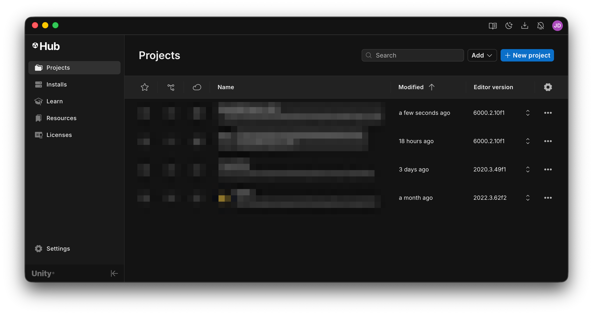
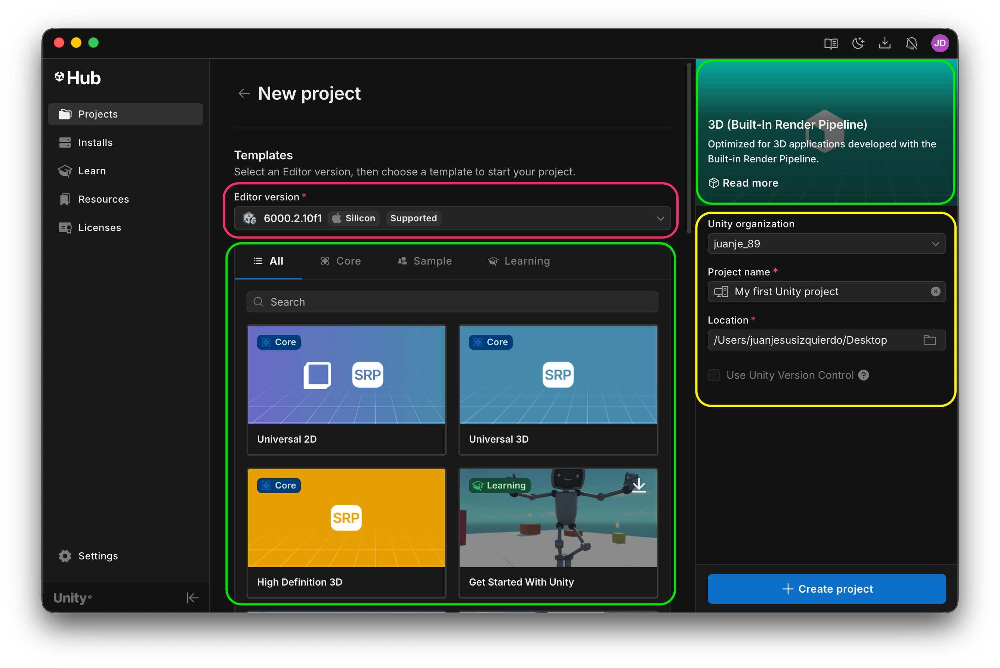
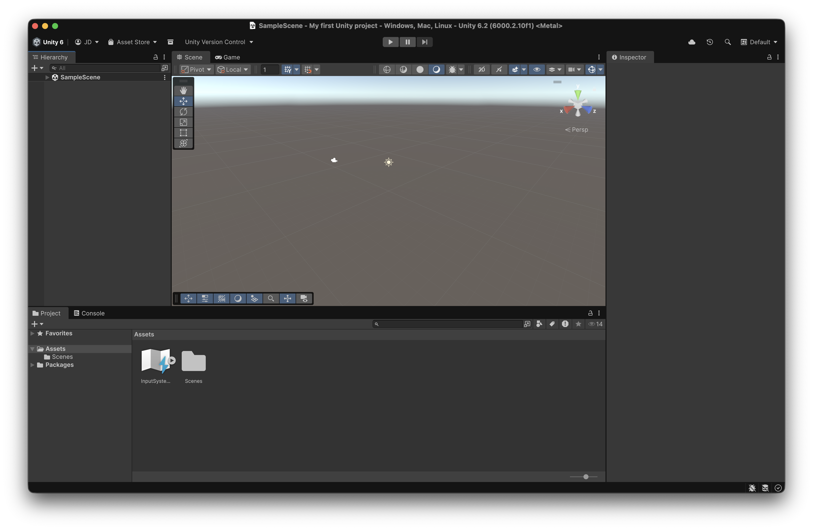

# Creating a project

With Unity Hub open, and with a version of Unity installed, we can create our first project:

<figure><figcaption>
Here, you will see all the projects in your machine, as well as which versions of Unity they are using
</figcaption></figure>

The next step is to choose a template, the project name, and the location (we can either choose _Universal 3D_ or _3D (Built-In Render Pipeline)_, though the later one is much simpler to start):

<figure><figcaption>
Window to select the unity version, template, project location...
</figcaption></figure>

1. In <mark style="background-color:red;">Pink</mark>, we have to choose the Unity version from the ones we have installed
2. In <mark style="background-color:green;">Green</mark>, we need to choose the template. The selecte template will appear in the top right corner
3. In <mark style="background-color:yellow;">Yellow</mark>, we select the organization (personal), and the location of the project

<figure><figcaption>
Unity's 6 loading screen
</figcaption></figure>

When the loading screen closes, the Unity editor will appear:

<figure><figcaption>
Default layout of the Unity editor
</figcaption></figure>
