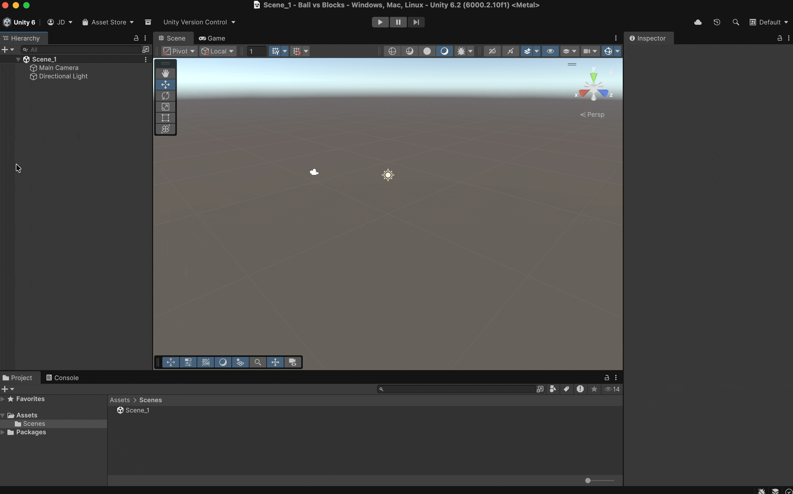

# Adding a Sphere

Let's create out player:

* Right-click in the **Hierarchy** → **3D Object → Sphere**.
* Rename it to `SpherePlayer`.
* Make sure its **Transform** position is `(0, 0.5, 0)`.

<figure><figcaption></figcaption></figure>
