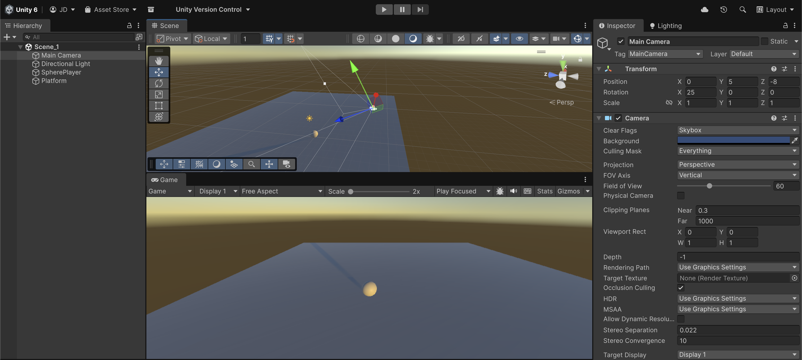

# Adjusting the Camera

Next step is to setup the camera's position, setting what the final user will see on their screen:

* Select the **Main Camera**.
* Position it at `(0, 5, -8)`&#x20;
* Rotate it to look toward the player: `Rotation (x: 25, y: 0, z: 0)`.


If you enter **Play Mode** or go into the **Scene view**, you will see how the game would look like on the final device.


<figure><figcaption></figcaption></figure>
