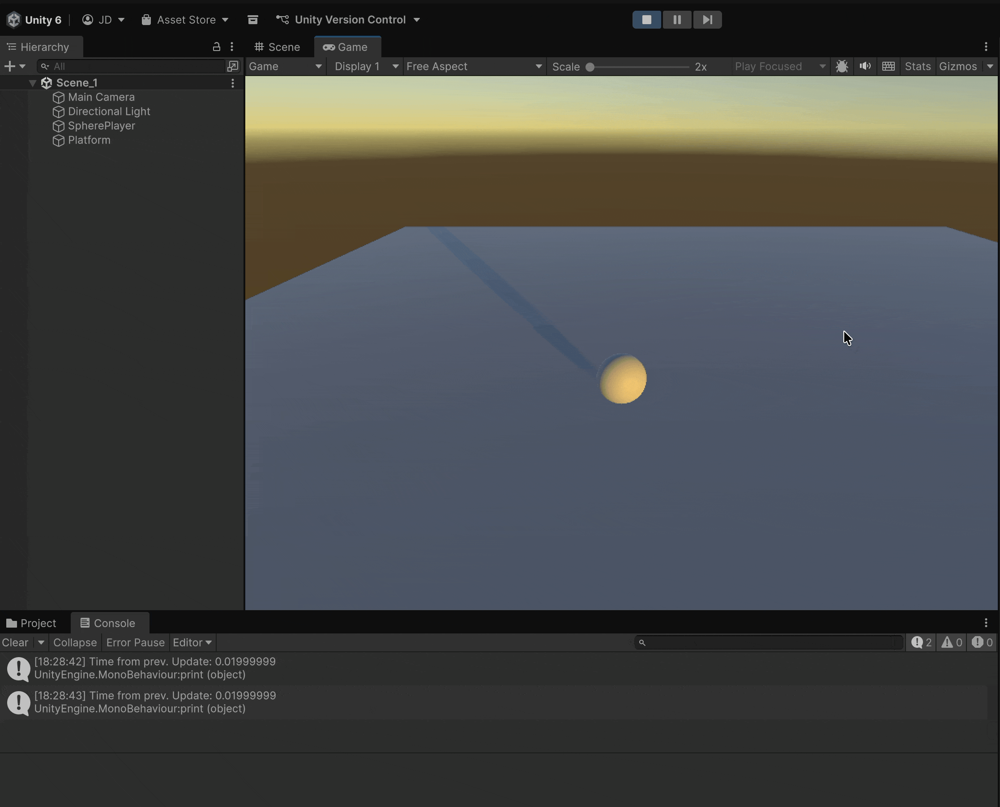
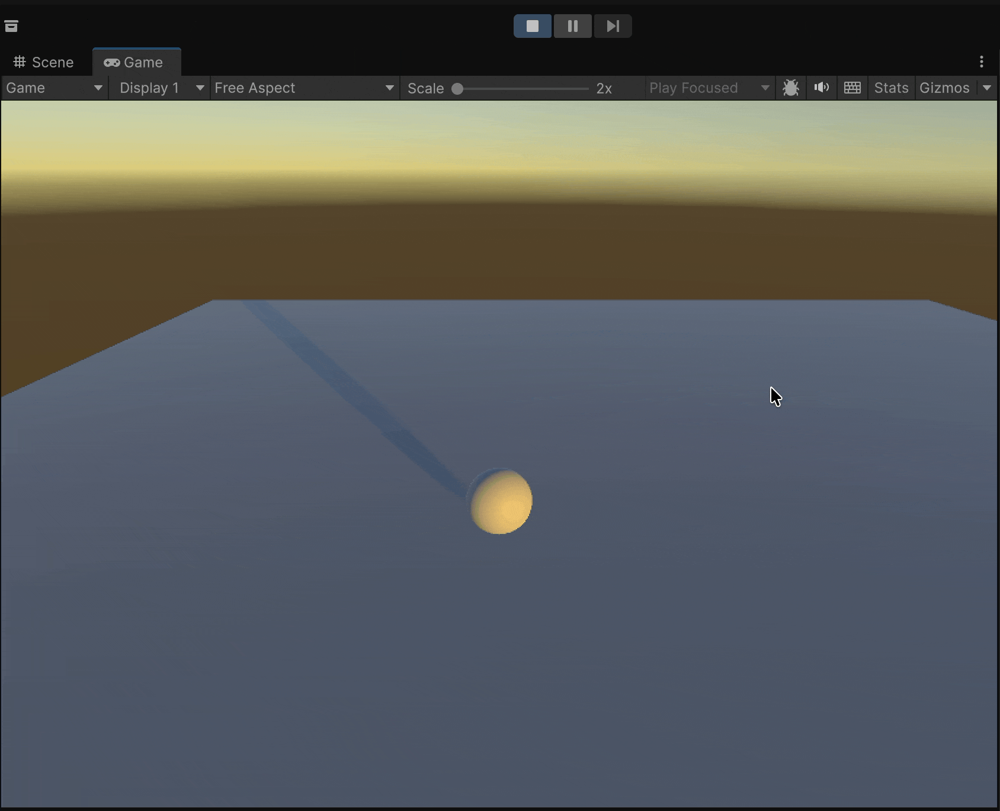
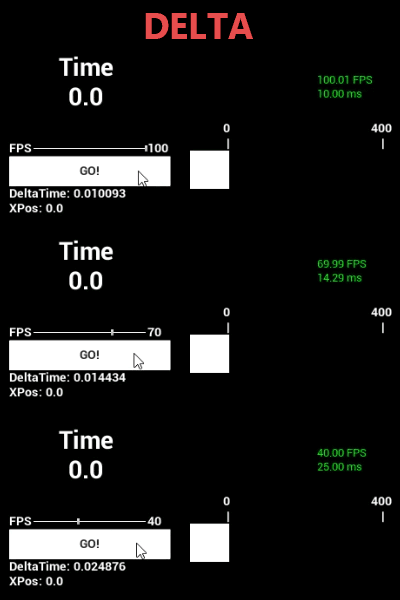

# Adjusting the velocity

A simple solution is to multiply the axis value by a factor so that it moves more slowly:

```csharp
float xMovement = Input.GetAxis("Horizontal") * 0.5f;
```

A better solution involves understanding how many times the `Update` method is executed.

### Time and Space in Unity

Unity uses **meters** and **seconds** as its units of measurement.

In the example, if we press the right arrow key, we are telling the sphere to move, <mark style="background-color:$danger;">**in 1 frame**</mark><mark style="background-color:$danger;">,</mark> <mark style="background-color:$danger;"></mark><mark style="background-color:$danger;">**1 meter to the right**</mark>, BUT, what we want now is for it to move <mark style="background-color:$success;">**1 meter in 1 second**</mark>.


It’s better for the movement to depend on **time** rather than the **framerate**, because we can’t guarantee a stable frame rate while the game is running—sometimes it would move faster, and other times slower.


In Unity, we can use the value `Time.deltaTime` inside the `Update` method to know the fraction of time that has passed between the previous frame (call N-1 to `Update`) and the current frame (call N to `Update`).

This way, if the game runs at **30 fps**, the sum of the 30 `Time.deltaTime` values within one second will equal **1**.

If we place the following call inside the `Update` method, we can see the value of `Time.deltaTime`:

```csharp
print($"Time from prev. Update: {Time.deltaTime}");
```

<figure><figcaption><p>The small numbers represent the time (in seconds) between the last call to Update and the current one</p></figcaption></figure>

To fix our problem and make the sphere move **1 meter per second**, we multiply the displacement by `Time.deltaTime` (regardless of the game’s framerate, whether it runs at 30 fps or 60 fps, it will always move 1 meter per second):

<pre class="language-csharp"><code class="lang-csharp">    void Update()
    {
        // print($"Time from prev. Update: {Time.deltaTime}");
<strong>        float xMovement = Input.GetAxis("Horizontal") * Time.deltaTime;
</strong>        transform.Translate(xMovement, 0, 0);

    }
</code></pre>

<figure><figcaption><p>A bit slower, but more responsive. We could multiply the vector by a scalar to make it faster</p></figcaption></figure>

<figure><figcaption><p>Same speed, different framerate</p></figcaption></figure>

### Moving along the Z axis and adjusting the speed from within the Unity Editor

If you modify the script with the following code, you will be able to **adjust the speed form the Editor**, however, if you <mark style="background-color:$warning;">**happen to modify these values during execution**</mark> (i.e., while playing), the new values will not be saved:

<pre class="language-csharp"><code class="lang-csharp">using UnityEngine;

public class BallMovement : MonoBehaviour
{
<strong>    public float xSpeed;
</strong><strong>    public float zSpeed;
</strong>    
    // Update is called once per frame
    private void Update()
    {
<strong>        float xMovement = Input.GetAxis("Horizontal") * Time.deltaTime * xSpeed;
</strong><strong>        float zMovement = Input.GetAxis("Vertical") * Time.deltaTime * zSpeed;
</strong><strong>        transform.Translate(xMovement, 0, zMovement);
</strong>    }
}
</code></pre>
