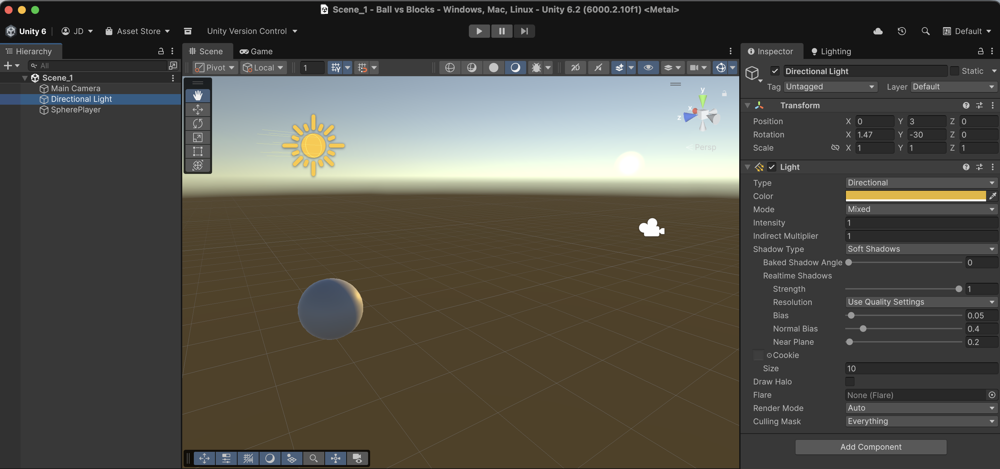
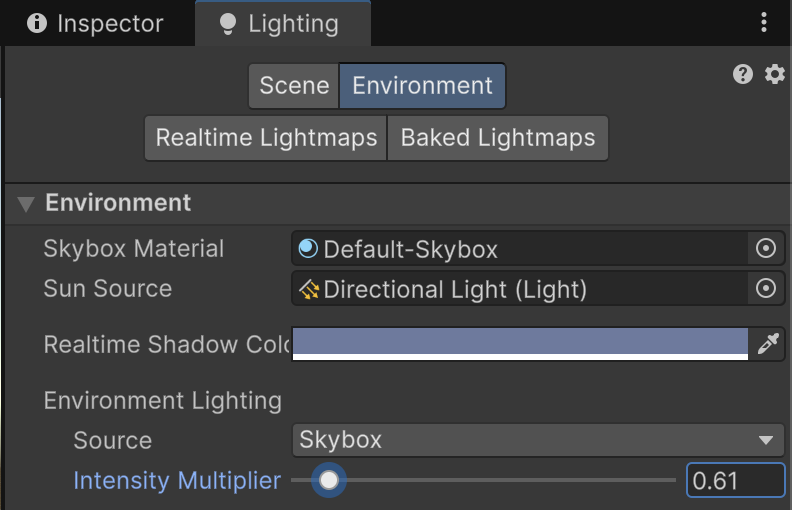

# Changing the Light

Select the **Directional Light** and adjust its parameters:

* **Type:** Directional
* **Color:** Warm yellow/orange for a sunset look
* **Intensity:** Around `1.0`
* **Shadows:** Soft Shadows

💡 Try rotating the light to get long shadows — it gives the game a more dramatic look.

<figure><figcaption></figcaption></figure>


You can also play with the Intensity Multiplier of the Scene's skybox through the Lighting window (you can open it from the _Window → Rendering_ top menu).


