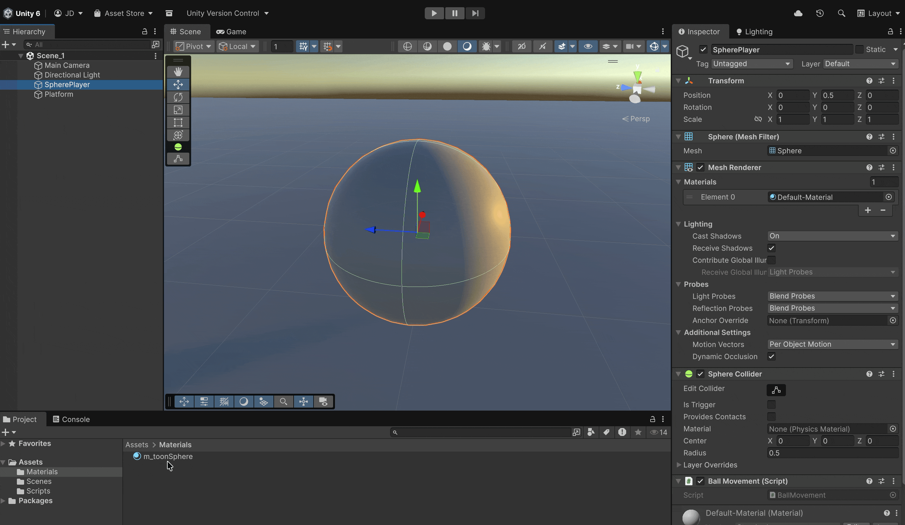
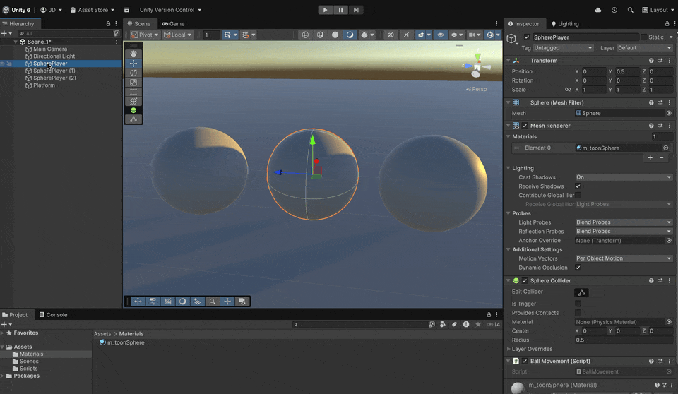
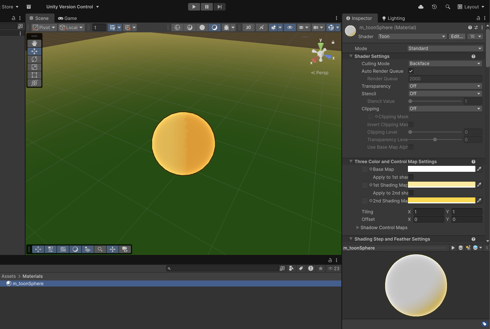
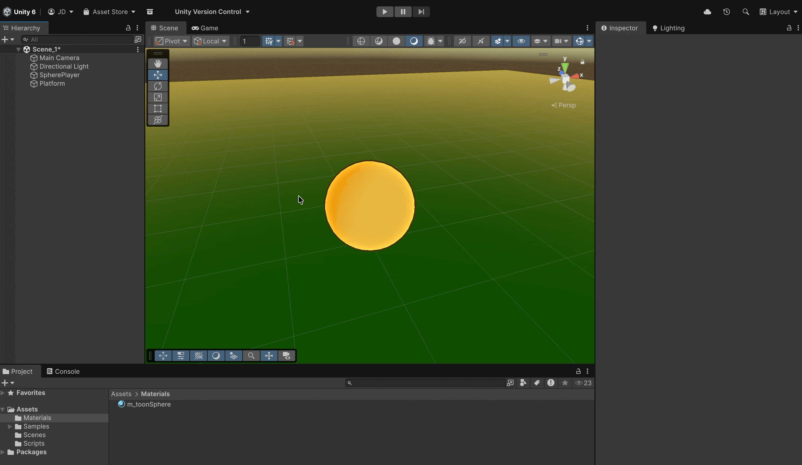
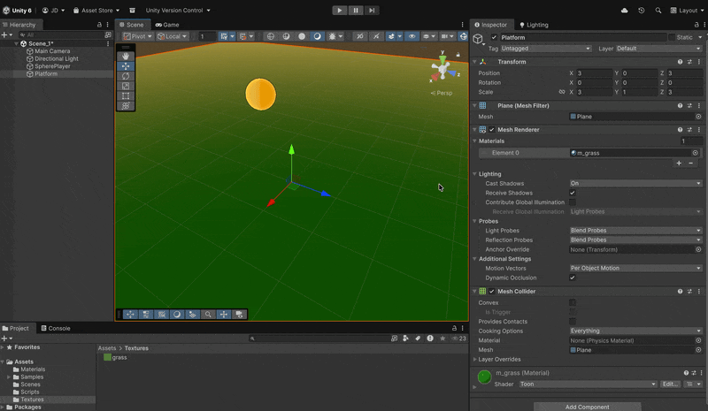
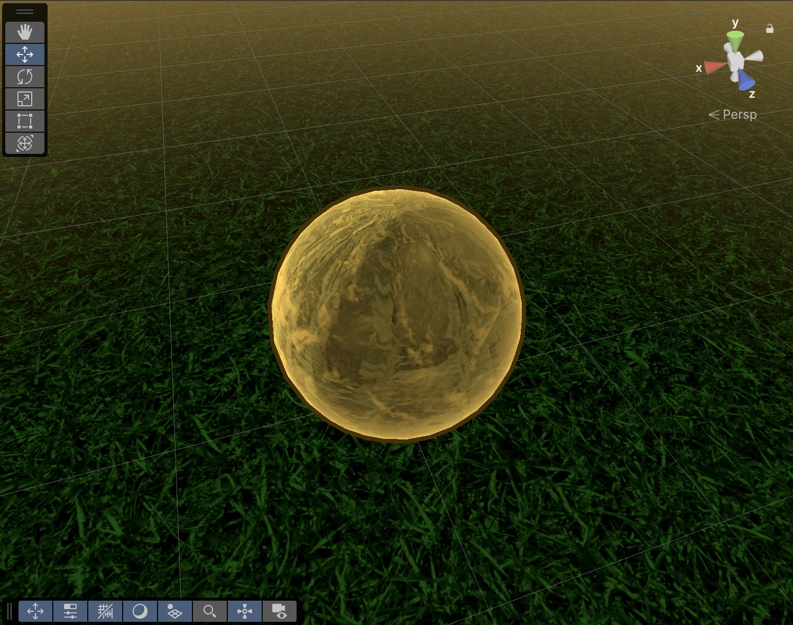

# Creating Materials and Textures

### Material creation

If we want to alter the default appearance of a mesh, we need to create a material for that mesh:



However, it is necessary to understant that a shader is applied to a material, and a material is applied to a mesh:

<table data-card-size="large" data-view="cards"><thead><tr><th></th><th data-hidden data-card-cover data-type="image">Cover image</th></tr></thead><tbody><tr><td>
A <strong>material</strong> is a combination of textures, colors, lighting effects, and other properties that are applied to a 3D object to determine how it looks when rendered on the screen.

To modify those properties, we assign a <strong>shader</strong> to the material, and then apply the material to a <strong>GameObject</strong> with a <strong>Renderer</strong> component.
</td><td><a href="../.gitbook/assets/sample_materials.png">sample_materials.png</a></td></tr><tr><td>
A <strong>shader</strong> is a program that runs on the <strong>GPU</strong> and defines how an object's pixels are processed when rendered on the screen. In other words, it is responsible for specifying how an object looks and how the scene’s lighting and shading affect it.

<strong>Shader types:</strong>
<ul><li><strong>Unlit:</strong> Not affected by lighting.</li><li><strong>Vertex-Lit:</strong> Calculate lighting based on vertices, making them more efficient for low-end devices.</li><li><strong>Diffuse:</strong> For standard materials affected by lighting, but without much detail.</li><li><strong>Normal mapped:</strong> Use an additional texture to add details such as grooves or bumps that aren’t part of the mesh.</li><li><strong>Specular:</strong> Add details such as reflections.</li></ul></td><td><a href="../.gitbook/assets/toon_shader.png">toon_shader.png</a></td></tr></tbody></table>

So, to create a material for the player, we need to follow these steps:

* We create a **Materials** folder inside the **Assets** folder.
* Right-click in the **Project** view (inside the Materials folder), then select **Create → Material**.
* Name it however you like, for example **"m\_toonSphere"**, since we’re going to apply a shader to the material with a “cartoon” effect.
* Apply the material to the sphere either by dragging it onto the sphere itself (from **Project** to **Scene**) or by dragging it into the first slot of the **Materials** property in the sphere’s **Mesh Renderer** component.
* After doing this, nothing will happen yet, because the material you just created has the **default shader** assigned.

<figure><figcaption></figcaption></figure>

If the same material is assigned to several meshes, and we change the material, all the meshes will be affected:

<figure><figcaption>
These 3 players share the same material
</figcaption></figure>

* Let's install this package, that gives us some new shader to play with! We need to do it using the Package Manager window (**Window → Package Management → Package Manager**) AND **install the Built-in render** Samples if you want



* Select the "m\_toonSphere" material, **change its shader from the dropdown above** to "toon" and play with the different values of the shader to adapt the appearance of the sphere!

<figure><figcaption></figcaption></figure>

<figure><figcaption></figcaption></figure>

### Texture creation

Materials, depending on the shader, allow to submit textures to keep altering the appearance of the mesh. Some of the most user textures are:

* Albedo (Diffuse) Map: Defines the base color of the material without lighting information.
* Normal Map: Simulates surface details like bumps or scratches without adding geometry.
* Height (Displacement) Map: Adds depth by displacing vertices or simulating parallax.

So, let's download this texture and drag it inside a new Textures folder:



In this case, we're going to apply it on the ground plane.&#x20;

* If you have not done it before, create a new material for the ground
* Find the "Base Map" and/or "1st Shading Map" inside "Three Color and Control Map Settings"
* Drag the texture into that field
* Make the tiling property bigger


Depending on the shader and the version of the very own toon package, these names may vary


<figure><figcaption></figcaption></figure>

Now, try to apply this new texture on the Player sphere:



<figure><figcaption></figcaption></figure>
