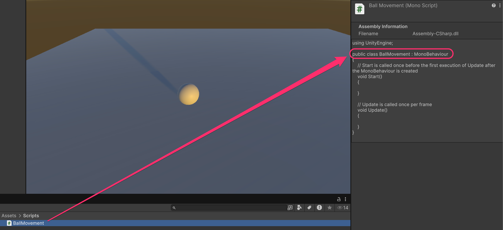
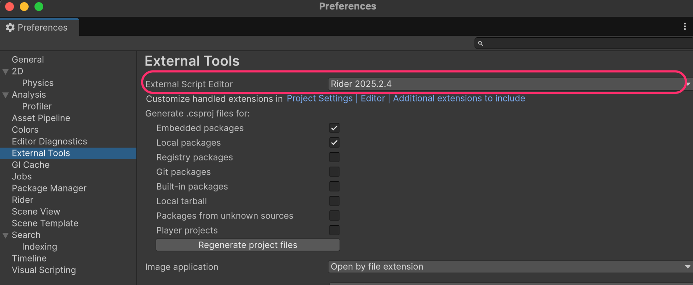
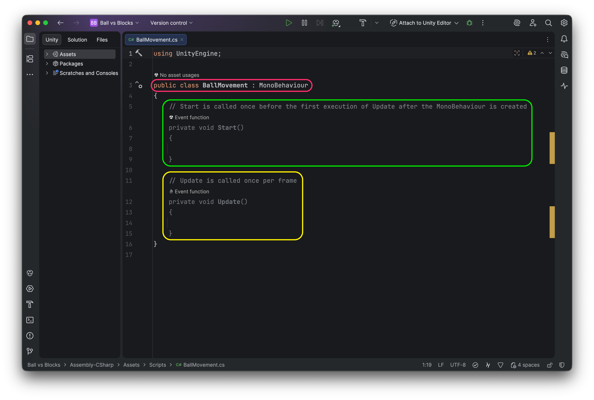

# Creating our first C# script

To make the ball move, we need to create our own script/components:

* Inside **Assets**, create a new folder named `Scripts`.
* Right-click on that folder → **Create → MonoBehaviour Script**
* Name it `BallMovement` when prompted to do so


It is very important to specify the correct name after creating the script (because a class with that name will be created).

If you write a wrong name, you will have to rename both the file and the class inside to have matching names.


<figure><figcaption>
The name of the file must match the name of the class
</figcaption></figure>

If you have configured the IDE correctly, double-clicking on the script will open it in the selected IDE:

<figure><figcaption></figcaption></figure>

The script will look like this:

<figure><figcaption>
Default Unity's C# script
</figcaption></figure>

And it has several elements of interest:

1. <mark style="background-color:red;">Class that inherits from</mark> [<mark style="background-color:red;">**`MonoBehaviour`**</mark>](https://docs.unity3d.com/6000.2/Documentation/ScriptReference/MonoBehaviour.html)
   * Unity applies the concepts of the OO paradigm; however, for Unity to be able to execute the scripts we add to different objects, they must inherit from the `MonoBehaviour` class.
   * In fact, we won't see constructor or destructor methods as such. Unity expects us to work in a somewhat specific way.
2. <mark style="background-color:green;">Special</mark> [<mark style="background-color:green;">**`Start`**</mark>](https://docs.unity3d.com/ScriptReference/MonoBehaviour.Start.html) <mark style="background-color:green;">method</mark>
   * The code in this method will execute ONLY once, **when the object is activated for the first time** (we can activate and deactivate GameObjects both from the Hierarchy view and during game execution)
   * It executes before the first call to `Update`
3. <mark style="background-color:yellow;">Special</mark> [<mark style="background-color:yellow;">**`Update`**</mark>](https://docs.unity3d.com/ScriptReference/MonoBehaviour.Update.html) <mark style="background-color:yellow;">method</mark>
   * This method is automatically invoked when the GameObject is active, **every frame**
   * If the game runs at 30 fps, the method would execute 30 times per second (but the framerate is usually variable, depending on the complexity of the scene and the machine's load...)


Unity offers the possibility to "override" a series of special methods for different purposes (as long as the class inherits from `MonoBehaviour`):

* Detect a collision
* Detect when the camera sees the object
* Detect that the application has been paused
* ...

