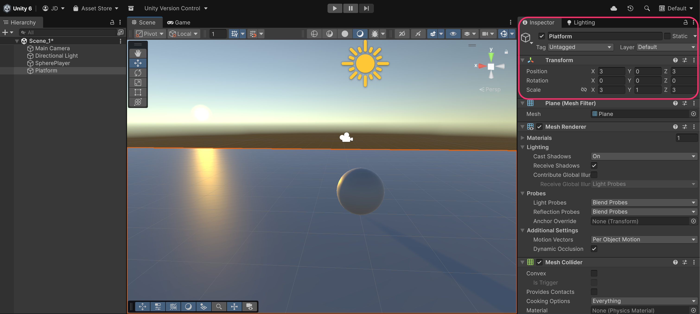

# Creating the ground

Next step is to create the ground so that the player does not fall into the void, FOREVER:

* Right-click in the **Hierarchy** → **3D Object → Plane**.
* Rename it to `Platform`.
* Place it at `Position (x: 3, y: 0, z: 3)`.
* Scale it slightly: `Scale (x: 3, y: 1, z: 3)`.

<figure><figcaption></figcaption></figure>
