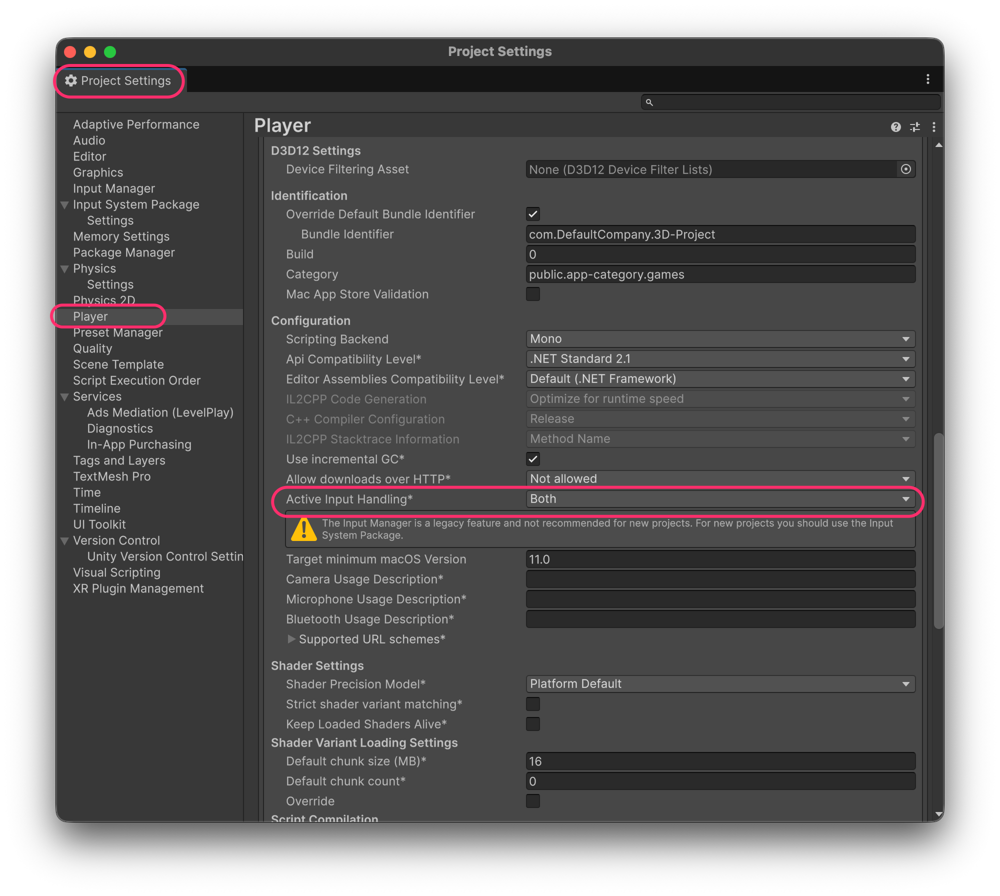
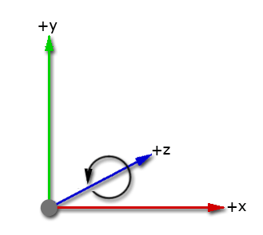
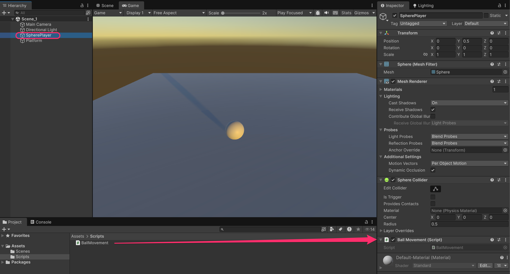
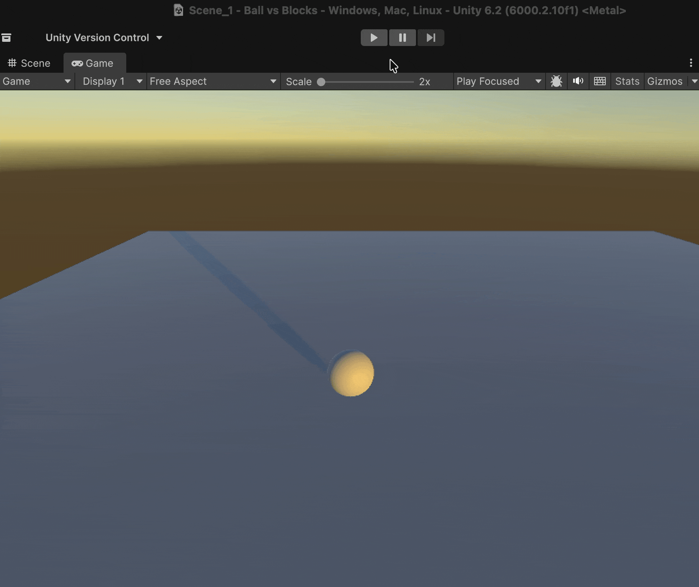

# Input with the Keyboard

The following step is to read the input from the Keyboard and translate it into moving the player:


To use the Keyboard in an _easy manner_, we need to enable the old input system.

To do this, we have to:

* Open the Build Profiles window (ctrl + shift + B)
* Click on the Player Settings button
* Search for a section called Other Settings (and unfold it)
* Inside that section, find the "Active Input Handling\*" property and change it from New to Both
* Unity will tell you that a restart is needed, so do it


<figure><figcaption><p>Enable the Old input system as well for simplicity</p></figcaption></figure>

* Now, write the following code inside the `Update` method:

```csharp
    private void Update()
    {
        float xMovement = Input.GetAxis("Horizontal");
        transform.Translate(xMovement, 0, 0);
    }
```

[`Input.GetAxis(axisName)`](https://docs.unity3d.com/ScriptReference/Input.GetAxis.html) allows detecting when we press the direction keys of a specific axis, such as "Horizontal" and "Vertical".

The call to this method will return a negative value (max. -1) or a positive one (max. 1).

<figure><figcaption></figcaption></figure>

### Executing the script

To execute the script, we must **add it as a component to a GameObject** in the scene, in this case, to the sphere:

* Either we drag it onto the Inspector view with the GameObject selected,
* Or we click on the "Add Component" button and select it.

<figure><figcaption><p>Adding a new <strong>Component</strong> to a <strong>GameObject</strong> allows us to give it <em>new behaviours</em></p></figcaption></figure>


As you can intuit, a GameObject as such doesn't have a particular functionality. It's the **components** we add to it that **specialize such GameObject**. In this case, the sphere has the following components:

* `Transform`: Position, rotation and scale
* `Mesh Filter` and `Renderer`: To visualize the mesh (materials, shader, textures...)
* `Sphere Collider`: To detect collisions
* `BallMovement`: Custom script so that it moves on the X axis


If we play the game, we will see that the player moves too fast, hence the game is not playable and needs to be fixed:&#x20;

<figure><figcaption></figcaption></figure>
