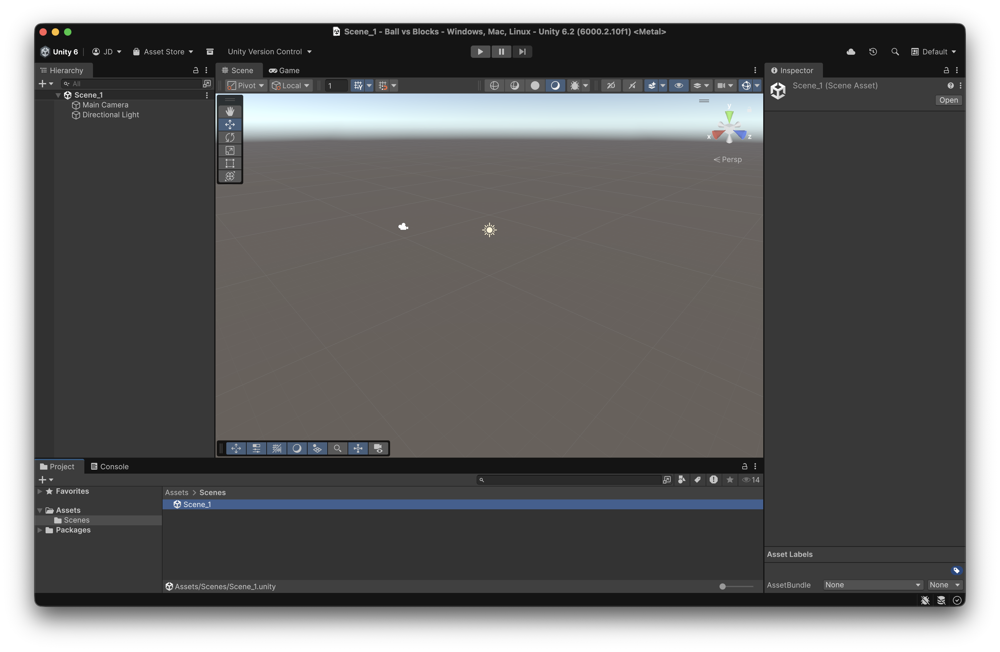

# Scene creation

Create a new Unity project using the **3D (Built-in Render Pipeline) template**, and call it **Ball vs Blocks**

* From the top menu: **File → New Scene (Basic, Built-in)**
* Remove any leftover assets from previous scenes.
* Press **Ctrl/Cmd + S** and save it as `Scene_1` in the **Scenes** folder.


You can also rename the existing `SampleScene` into `Scene_1`


<figure><figcaption></figcaption></figure>
