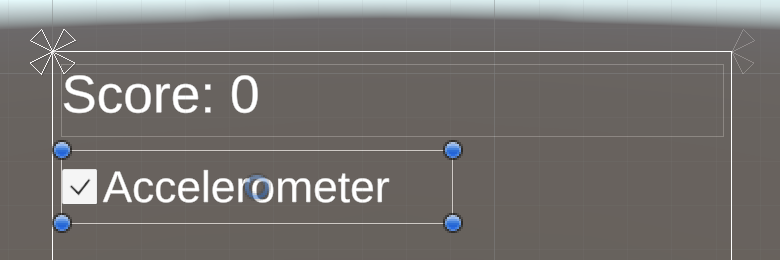
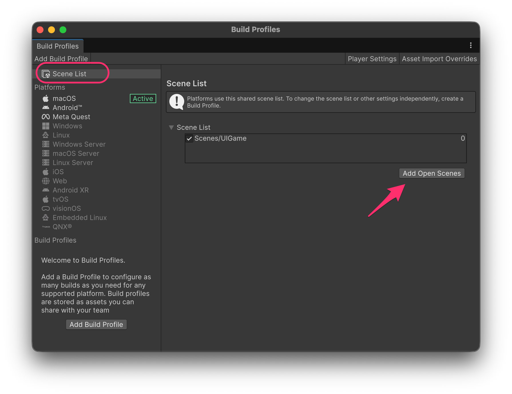
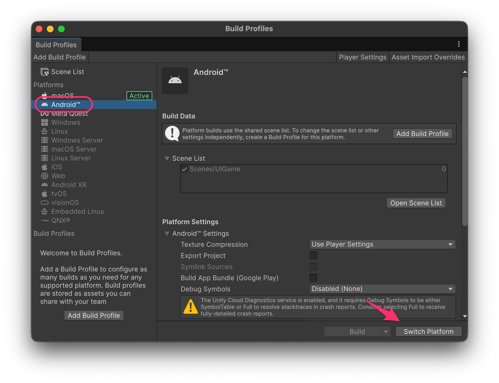
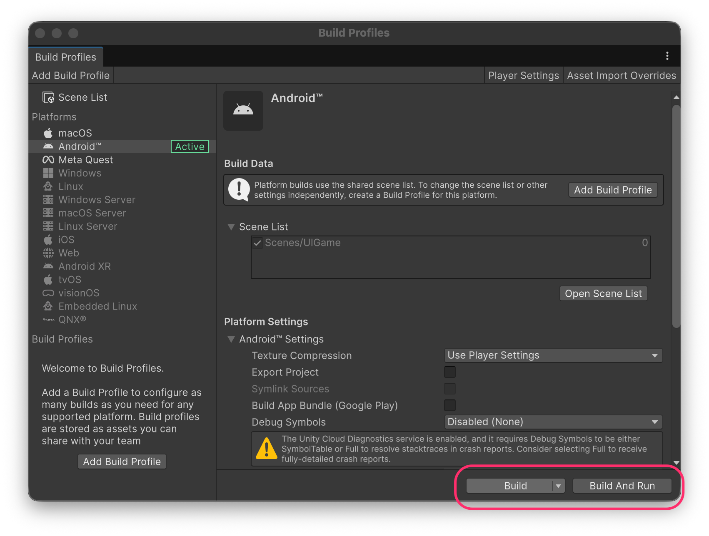

# Executing in Android

Considering that most **mobile devices** include **accelerometers** and **gyroscopes**, it would not be difficult to modify the previous **sphere example** to allow the ball to be moved based on the **tilt of the device**.

<pre class="language-csharp"><code class="lang-csharp">using System;
using UnityEngine;
using UnityEngine.Events;

public class SpherePlayer : MonoBehaviour
{
    public UnityEvent onClashedWithCylinder = new();

    public SphereMovementButton buttonLeft, buttonRight, buttonUp, buttonDown;
    public float speed = 10.0f;
    public float accelerometerSensitivity = 1.0f;

    public bool useAccelerometer = true;
    private int _xDirection = 0, _zDirection = 0;
    private Rigidbody _rigidbody;
    private AudioSource _audio;

    private void OnEnable()
    {
        buttonLeft.OnButtonDown += OnButtonDown;
        buttonRight.OnButtonDown += OnButtonDown;
        buttonUp.OnButtonDown += OnButtonDown;
        buttonDown.OnButtonDown += OnButtonDown;

        buttonLeft.OnButtonUp += OnButtonUp;
        buttonRight.OnButtonUp += OnButtonUp;
        buttonUp.OnButtonUp += OnButtonUp;
        buttonDown.OnButtonUp += OnButtonUp;
    }

    private void OnDisable()
    {
        buttonLeft.OnButtonDown -= OnButtonDown;
        buttonRight.OnButtonDown -= OnButtonDown;
        buttonUp.OnButtonDown -= OnButtonDown;
        buttonDown.OnButtonDown -= OnButtonDown;

        buttonLeft.OnButtonUp -= OnButtonUp;
        buttonRight.OnButtonUp -= OnButtonUp;
        buttonUp.OnButtonUp -= OnButtonUp;
        buttonDown.OnButtonUp -= OnButtonUp;
    }

    private void Awake()
    {
        _rigidbody = GetComponent&#x3C;Rigidbody>();
        _audio = GetComponent&#x3C;AudioSource>();
    }

    private void OnButtonDown(SphereMovementButton.SphereDirection direction)
    {
        if (useAccelerometer) return;

        switch (direction)
        {
            case SphereMovementButton.SphereDirection.Up:
                _zDirection = 1;
                break;
            case SphereMovementButton.SphereDirection.Down:
                _zDirection = -1;
                break;
            case SphereMovementButton.SphereDirection.Left:
                _xDirection = -1;
                break;
            case SphereMovementButton.SphereDirection.Right:
                _xDirection = 1;
                break;
            default:
                throw new ArgumentOutOfRangeException(nameof(direction), direction, null);
        }
    }

    private void OnButtonUp(SphereMovementButton.SphereDirection direction)
    {
        _rigidbody.linearVelocity = Vector3.zero;
        _rigidbody.angularVelocity = Vector3.zero;

        _xDirection = 0;
        _zDirection = 0;
    }
    
    public void ToggleAccelerometer(bool active)
    {
        useAccelerometer = active;
    }

    private void FixedUpdate()
    {
        if (useAccelerometer)
        {
<strong>            float xAcceleration = Input.acceleration.x;
</strong><strong>            float zAcceleration = Input.acceleration.y;
</strong>
            Vector3 horizontalAcceleration = Vector3.right * (xAcceleration * accelerometerSensitivity);
            Vector3 verticalAcceleration = Vector3.forward * (zAcceleration * accelerometerSensitivity);

            _rigidbody.AddForce(horizontalAcceleration + verticalAcceleration, ForceMode.Acceleration);
        }
        else
        {
            Vector3 horizontalSpeed, verticalSpeed;

            if (_xDirection == 0)
                horizontalSpeed = Vector3.zero;
            else
                horizontalSpeed = _xDirection == -1 ? Vector3.left * speed : Vector3.right * speed;

            if (_zDirection == 0)
                verticalSpeed = Vector3.zero;
            else
                verticalSpeed = _zDirection == -1 ? Vector3.back * speed : Vector3.forward * speed;

            _rigidbody.AddForce(horizontalSpeed + verticalSpeed, ForceMode.Acceleration);
        }
    }

    private void OnCollisionEnter(Collision collision)
    {
        if (!collision.gameObject.CompareTag("Obstacle")) return;

        _audio.Play();
        onClashedWithCylinder?.Invoke();
    }
}
</code></pre>

* Add a **checkbox** UI element (`Toggle` component) to enable and disable the accelerometer:


You will need to make some adaptations since it uses the **old** `Text` component.


<figure><figcaption></figcaption></figure>

* You must connect the **OnValueChanged** event of the **Toggle** component to the **`ToggleAccelerometer`** method of the **sphere:**

<figure><figcaption></figcaption></figure>

***

### Adding the scene to the Build Profiles

In order to execute our app on Android devices, we must first add the scene to the **Build Profiles** window:



<figure><figcaption></figcaption></figure> <figure><figcaption></figcaption></figure>

Now, we have two options:

* **Build**: Generates the _.apk_ file
* **Build And Run**: Generates the _.apk_ file and installs it in the connected Android devices

<figure><figcaption></figcaption></figure>


The device must be in [**developer mode**](https://developer.android.com/studio/debug/dev-options?hl=es-419) and _USB Debugging_ must be enabled (inside the developer options).

Additionally, make sure that:

* The orientation is set to **Portrait** (to avoid orientation changes) in the Player Settings window, under _Player → Resolution and Presentation_
* A **Package Name** is assigned in the **Player Settings** window, under _Player → Other Settings_.

