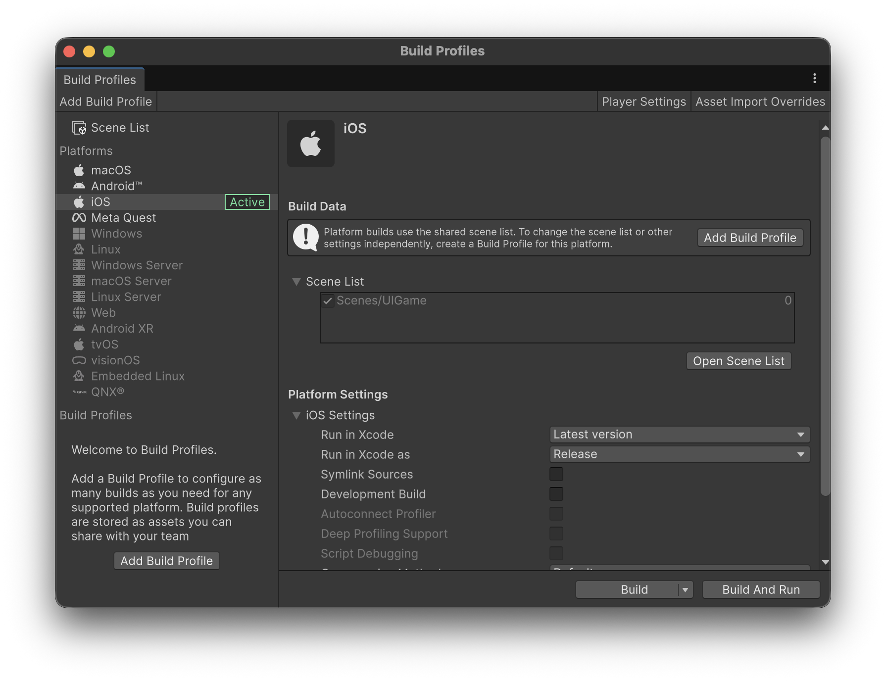
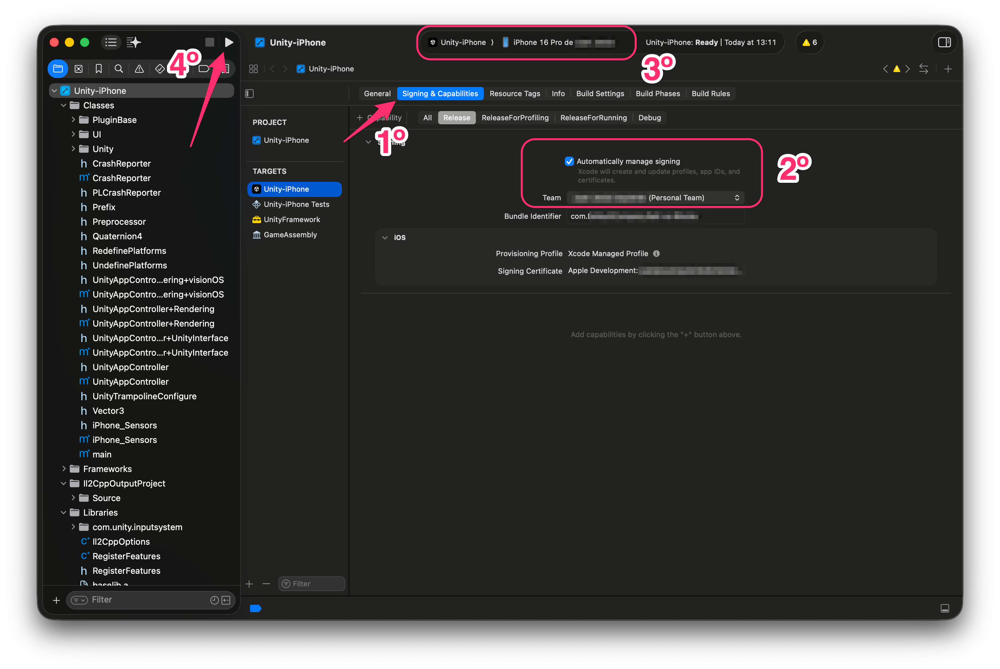
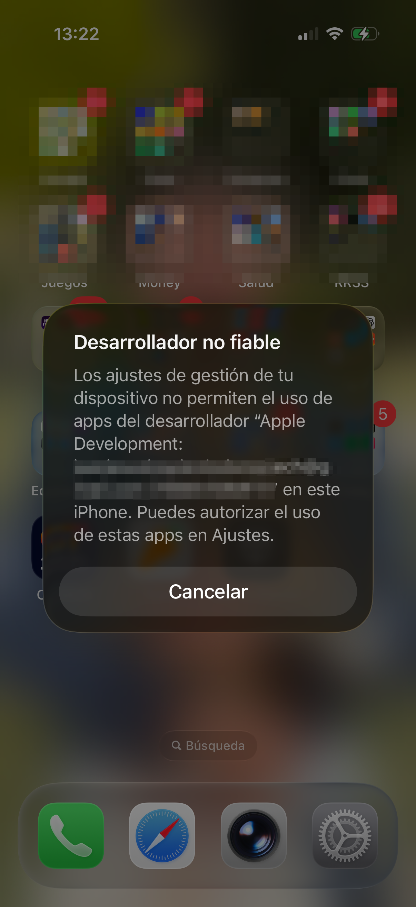
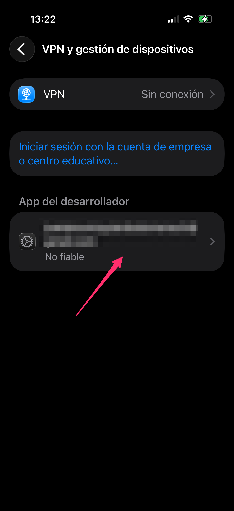
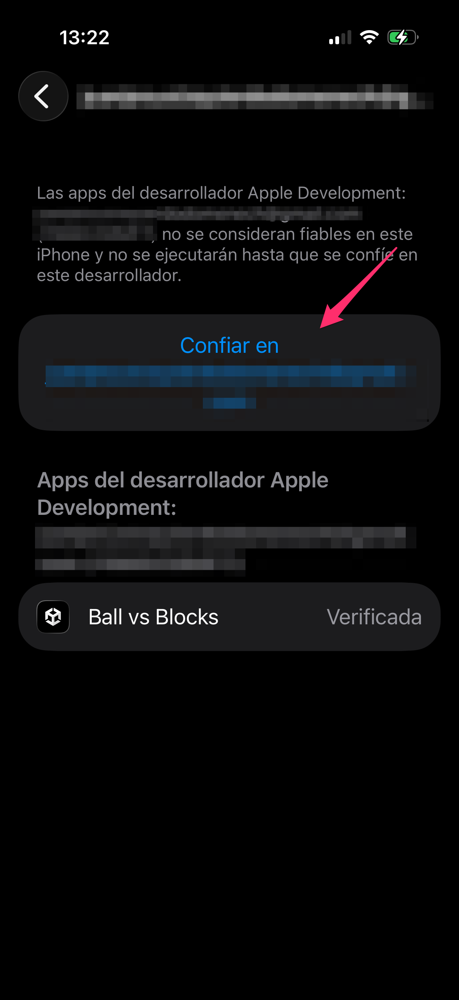

# Executing in iOS

In a similar way, we can deploy this app on iOS devices.


To run the project on an **iOS device** (iPhone or iPad), you need:

* A **Mac**
* **Xcode** installed
* An [**Apple Developer Account**](https://developer.apple.com/)


The first thing you have to do (if the iOS module is installed), is to **switch the platform** to iOS:

<figure><figcaption></figcaption></figure>

* Clicking the **Build** button will generate an **Xcode project,** open it and configure the **Signing & Capabilities**:

<figure><figcaption></figcaption></figure>

The first time you execute the app, your phone won't trust the app, so you have to manually trust the developer (you) to execute the app:

<figure><figcaption></figcaption></figure>

* Go to **Settings&#x20;**_**→**_**&#x20;General&#x20;**_**→**_**&#x20;VPN & Device Management** and trust yourself:

<figure><figcaption></figcaption></figure> <figure><figcaption></figcaption></figure>

