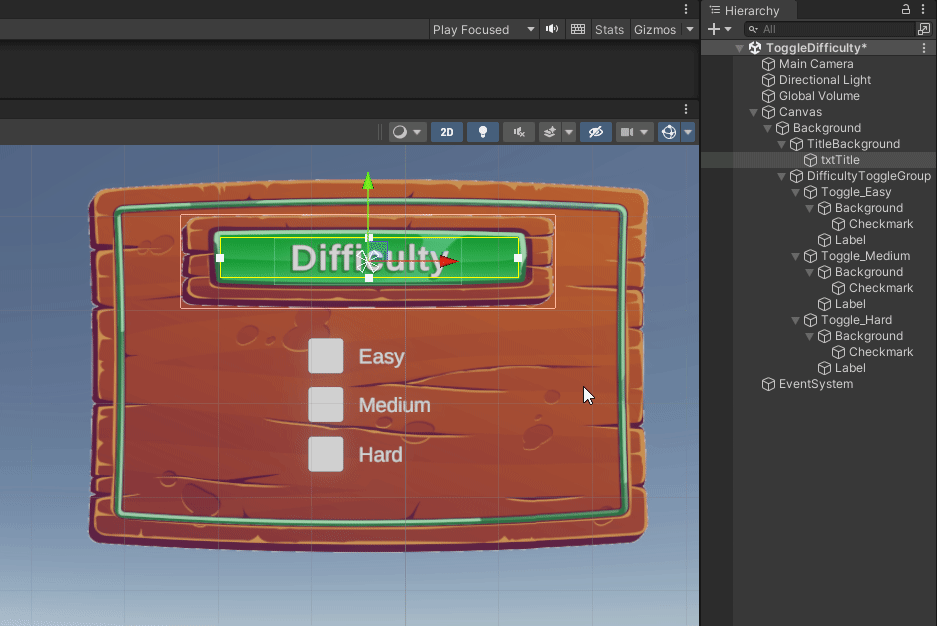

# Graphical User Interfaces

Unity provides a set of powerful, **visual tools** for designing **graphical user interfaces (GUIs)** directly within the Editor.

This system allows developers and designers to build interactive menus, HUDs (Heads-Up Displays), and other interface elements without writing complex layout code.

<figure><figcaption></figcaption></figure>

### UI Workflow overview

The workflow for creating UI elements in Unity, while introducing some specific concepts (like **anchors** and **canvas scaling**), is fundamentally similar to the process we’ve followed so far, because it still relies on **GameObjects** and **components**.

Each UI element is essentially a **GameObject** with specific components that define its appearance and behavior.

For example:

* A GUI **Button** is a GameObject that includes:
  * A special type of _**Transform**_, called a **`RectTransform`**, which defines position and size within the canvas.
  * A **`Button`** component, which handles user interactions such as clicks.
  * An **`Image`** component, which renders the button’s background or graphic.
* The **Button** typically has a **child GameObject** containing:
  * A **`RectTransform`**, to position the text inside the button.
  * A  **`TextMeshPro - Text`** component, which displays the button label.


All UI elements exist within a **Canvas**, which acts as the root of the interface and determines how elements are rendered on screen.


Through **anchors**, **pivot points**, and **layout groups**, Unity’s UI system adapts automatically to different screen sizes and resolutions, ensuring a consistent user experience across devices.
