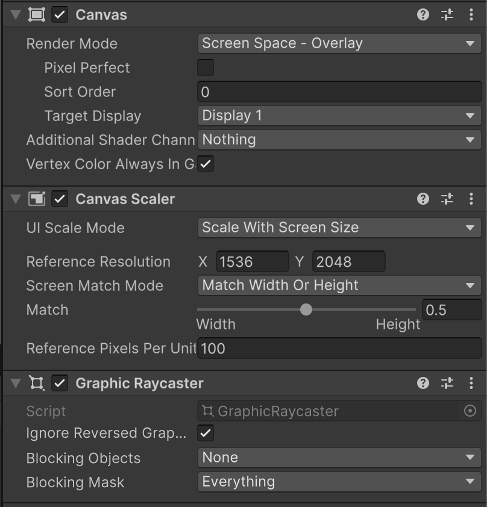
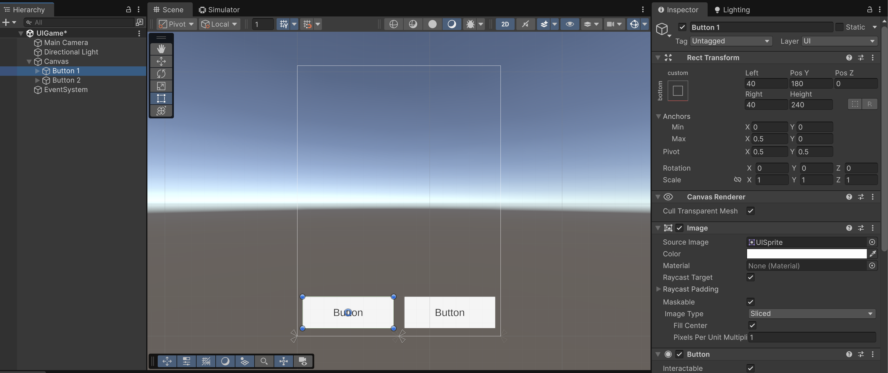
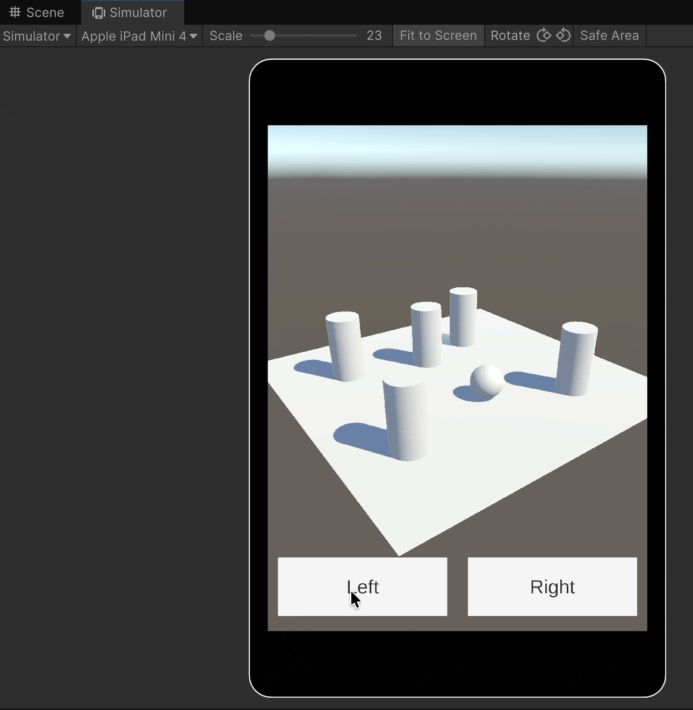
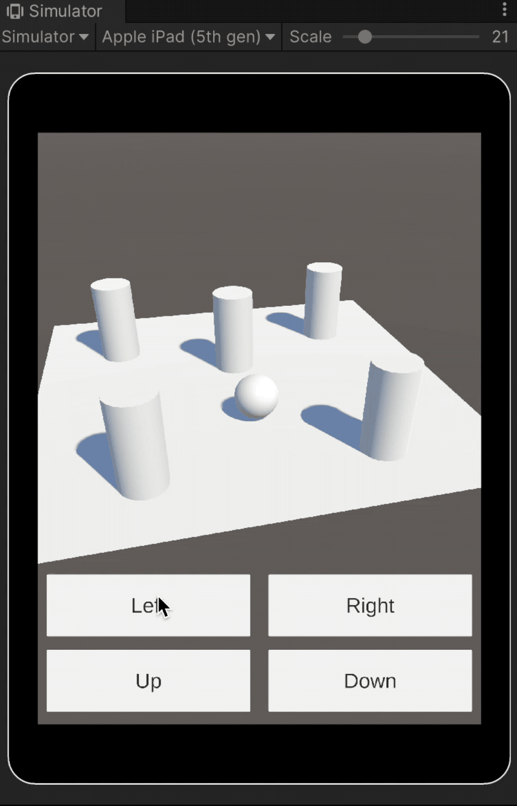
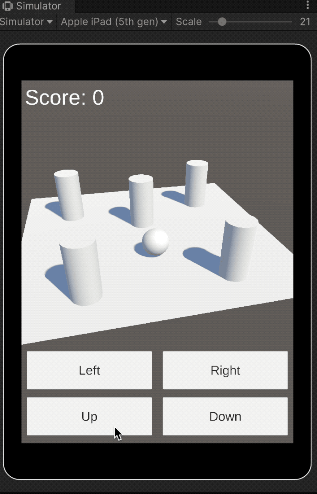

# An example step by step

* In a new scene, create a **`Canvas`** set to _**Screen Space – Overlay**_, and then modify its **`CanvasScaler`** component as shown in the image:

<figure><figcaption></figcaption></figure>


The **`CanvasScaler`** component allows you to define a **reference resolution** for designing your interface\
(for example, an iPad 5th generation in **portrait** orientation).

This ensures that all UI elements automatically **scale up or down** depending on the actual screen size of the target device. As a result, the interface maintains consistent proportions and readability across different resolutions and aspect ratios.


* Add **two buttons** to the **bottom of the screen**, positioning them so that **each occupies half of the available width**:

<figure><figcaption></figcaption></figure>

<figure><figcaption></figcaption></figure>

* Change the button labels to **“Left”** and **“Right”**.
* Then, **design a scene** similar to the one shown below:

<figure><figcaption></figcaption></figure>

* Make sure the sphere has a `Rigidbody` component.
* Add the following script to **both buttons** to detect when the user **presses** and **releases** them, and configure each button’s **movement direction** from the Inspector:

<pre class="language-csharp"><code class="lang-csharp">using UnityEngine;
using UnityEngine.EventSystems;

public class SphereMovementButton : MonoBehaviour, IPointerDownHandler, IPointerUpHandler
{
    public enum SphereDirection
    {
        Left, Right
    }

    public SphereDirection direction;
    
    public delegate void SphereMovementButtonInteract(SphereDirection dir);
    public event SphereMovementButtonInteract OnButtonDown;
    public event SphereMovementButtonInteract OnButtonUp;

<strong>    public void OnPointerDown(PointerEventData eventData)
</strong>    {
        OnButtonDown?.Invoke(direction);
    }

<strong>    public void OnPointerUp(PointerEventData eventData)
</strong>    {
        OnButtonUp?.Invoke(direction);
    }
}
</code></pre>

* Add the following script to the **sphere** so it can receive and respond to the **UI button events:**

```csharp
using UnityEngine;

public class SpherePlayer : MonoBehaviour
{
    public SphereMovementButton buttonLeft, buttonRight;
    public float speed = 10.0f;

    private int _xDirection = 0;
    private Rigidbody _rigidbody;

    private void OnEnable()
    {
        buttonLeft.OnButtonDown += OnButtonDown;
        buttonRight.OnButtonDown += OnButtonDown;
        
        buttonLeft.OnButtonUp += OnButtonUp;
        buttonRight.OnButtonUp += OnButtonUp;
    }

    private void OnDisable()
    {
        buttonLeft.OnButtonDown -= OnButtonDown;
        buttonRight.OnButtonDown -= OnButtonDown;
        
        buttonLeft.OnButtonUp -= OnButtonUp;
        buttonRight.OnButtonUp -= OnButtonUp;
    }

    private void Awake()
    {
        _rigidbody = GetComponent<Rigidbody>();
    }

    private void OnButtonDown(SphereMovementButton.SphereDirection direction)
    {
        if (direction == SphereMovementButton.SphereDirection.Left)
            _xDirection = -1;
        else
            _xDirection = 1;
    }
    
    private void OnButtonUp(SphereMovementButton.SphereDirection direction)
    {
        _rigidbody.linearVelocity = Vector3.zero;
        _rigidbody.angularVelocity = Vector3.zero;
        _xDirection = 0;
    }

    private void FixedUpdate()
    {    
        if (_xDirection == 0)
            return;
        
        var sp = _xDirection == -1 ? Vector3.left * speed : Vector3.right * speed;
        _rigidbody.AddForce(sp, ForceMode.Force);
    }
}
```

If you play the game, it should look like this:

<figure><figcaption></figcaption></figure>

### Challenges

#### Challenge 1

Modify the GUI to add **two more buttons**, labeled **“Up”** and **“Down”**, and update the script to move the sphere along the **Z axis:**

<figure><figcaption></figcaption></figure>



#### Challenge 2

Add physics to the **cylinders** so the sphere can knock them over.

Add a **sound** to the project to play when the ball collides with the cylinders.

1. **Import** the audio file.
2. Add an `AudioSource` component to the sphere.
3. Assign a **tag** named `"Obstacle"` to the cylinders.
4. Implement the **`OnCollisionEnter(Collision collision)`** method in the sphere so that, when it collides with a tagged cylinder, the sound is played.

#### Challenge 3

Add a **Text** element anchored to the **top** of the interface, occupying the **full width** of the screen, and set its initial content to **“Score: 0”.**

Whenever the sphere collides with an obstacle, you must add 1 to the score:

* Add this to the collison code:

```csharp
// Instance variable
public UnityEvent onClashedWithCylinder = new();

// Inside OnCollisionEnter, after detecting collidion eiyh sn obstacle
onClashedWithCylinder?.Invoke();
```

* Add a script to the text that listens to that event and updates the text

```csharp
_text.text = $"Score: {_score}";
```

<figure><figcaption></figcaption></figure>
