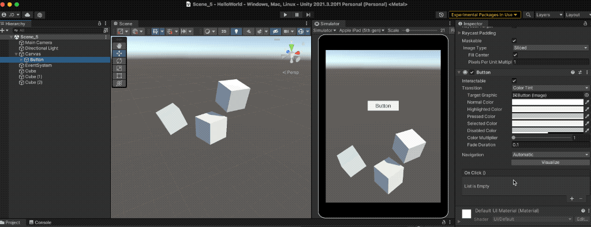
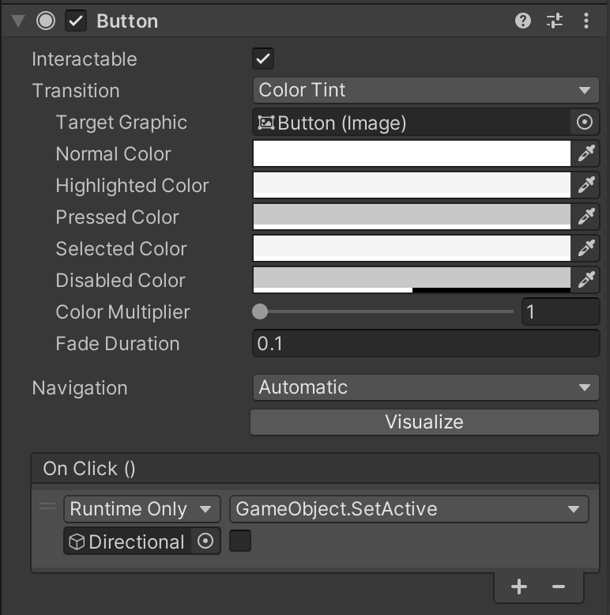
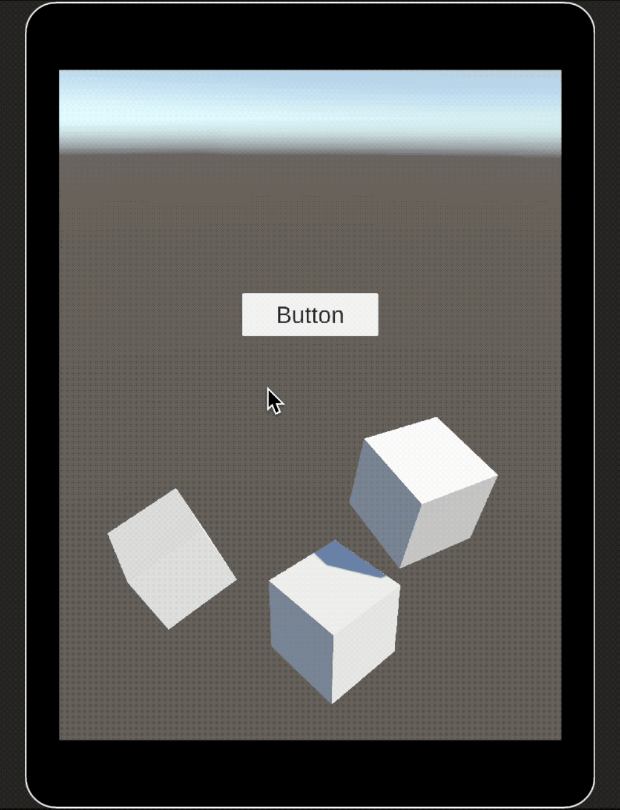

# Button



This component listens for the **`OnClick()`** event to perform specific actions when the user interacts with a **`Button`**.

When the button is clicked, it can trigger one or more responses, such as:

* **Modifying public properties** of any component attached to a GameObject.
* **Invoking public methods** from any component in the scene.

This makes the **`Button`** component a key element for creating **interactive interfaces**, allowing developers to connect UI events to in-game logic without writing additional code, all directly from the **Inspector**.

<figure><figcaption></figcaption></figure>

<figure><figcaption></figcaption></figure> <figure><figcaption></figcaption></figure>

