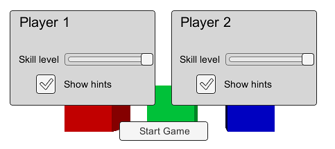
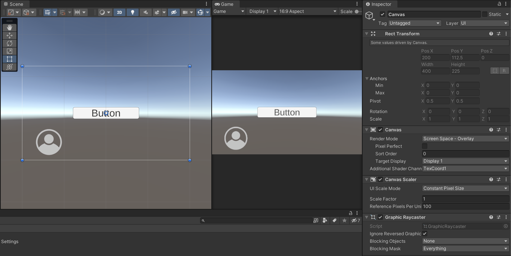
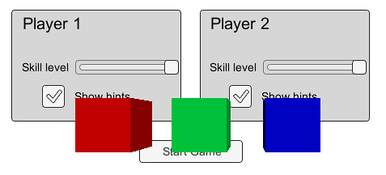
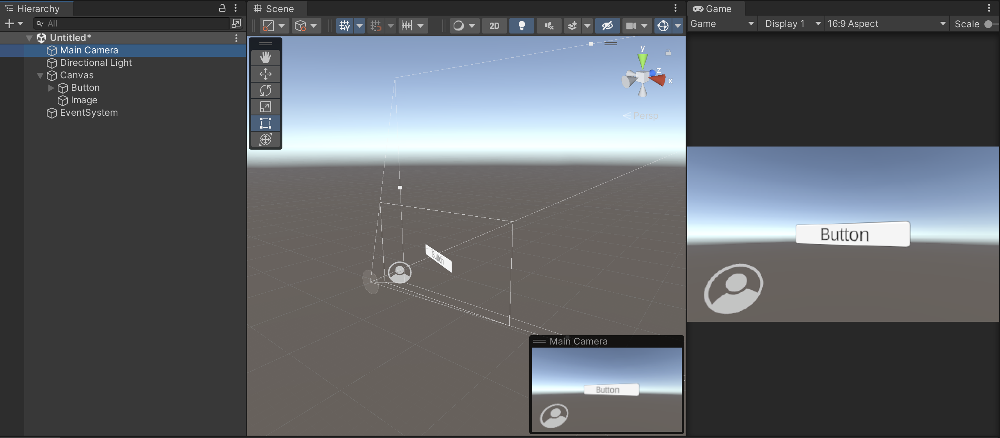
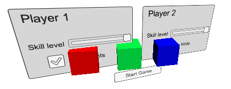
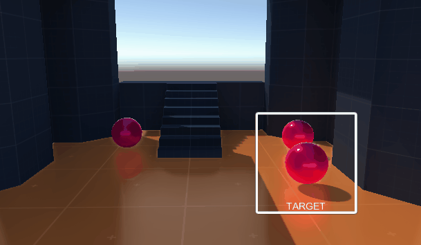

# Canvas



This element is essentially the **equivalent of Unity’s “world”**, but in **GUI coordinates** (i.e., screen space).\
It is required for rendering any graphical user interface (GUI) elements on the screen.

<figure><figcaption></figcaption></figure>

### Canvas Render Modes

The **Canvas** determines how UI elements are rendered, and Unity provides three main rendering modes:

#### **Screen Space – Overlay**

* In this mode, the Canvas covers the **entire screen space** (traditional 2D GUI).
* The position and scale of its **RectTransform** **cannot be modified**, since it automatically adjusts to the display size.
* **No camera** is needed to render this content.
* The rendering is always **orthographic**, meaning there’s no perspective distortion.
* Child objects **don’t use the Z-axis**, so there’s **no depth effect** — elements are layered based on hierarchy order.

<figure><figcaption></figcaption></figure> <figure><figcaption></figcaption></figure>

#### **Screen Space – Camera**

* Similar to the previous mode, but now the Canvas is **linked to a specific Camera**.
* This allows UI elements to be rendered **through the camera’s perspective**.
* The **Z-position** and **rotation** of UI elements can be adjusted to **simulate depth** or integrate interface elements within a 3D environment.

<figure><figcaption></figcaption></figure> <figure><figcaption></figcaption></figure>

#### **World Space**

* In this mode, the Canvas becomes part of the **3D world** itself.
* It has a **specific position, rotation, and scale** in the scene, just like any other GameObject.
* This is useful for interfaces that need to appear **within** the game world — for example, screens, panels, or labels attached to objects in 3D space.

<figure><figcaption></figcaption></figure> <figure><figcaption></figcaption></figure>

***

Each mode serves different purposes depending on the project’s needs:

* **Overlay** for classic HUDs or menus.
* **Camera** for interfaces that must follow a player’s viewpoint.
* **World Space** for diegetic UI elements integrated into the 3D environment.
