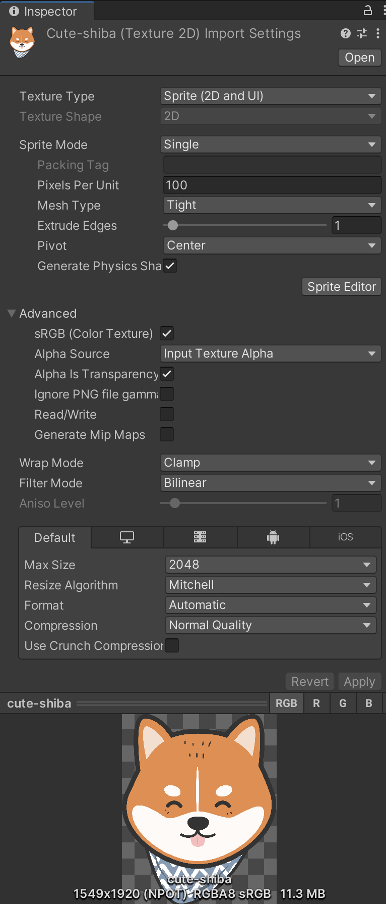

# Image



This component allows Unity to **render any texture** added to the project, as long as the texture’s **type** is set to **“Sprite (2D and UI)”**.

<figure><figcaption></figcaption></figure> <figure><figcaption></figcaption></figure>

When attached to a **UI element**, such as an **`Image`** inside a `Canvas`, it takes the assigned **sprite** and displays it on the screen according to the element’s **RectTransform** properties (position, size, and anchors).

This makes it one of the most fundamental components for building visual interfaces, useful for displaying:

* Backgrounds and icons.
* Character portraits.
* Health bars, panels, or decorative frames.

#### Example

<pre class="language-csharp"><code class="lang-csharp">using System.Collections;
using UnityEngine;
using UnityEngine.UI;

public class FillImageGradual : MonoBehaviour
{
    public float duration = 4f; 
    public bool startOnAwake = true;
    public bool loop = true;

<strong>    private Image _image;
</strong>    
    void Awake() {
<strong>        _image = GetComponent&#x3C;Image>();
</strong>        if (startOnAwake) {
            StartCoroutine(Fill());
        }
    }

    private IEnumerator Fill() {

        while (true) {
            float t = 0f;
            while (t &#x3C; 1f) {
                t += Time.deltaTime / duration;
                float fillAmount = Mathf.PingPong(t, 1f);
<strong>                _image.fillAmount = fillAmount;
</strong>                yield return null;
            }

            _image.fillAmount = 1; // Small adjustment
            if (!loop) 
                break;
        }
    }
}
</code></pre>
