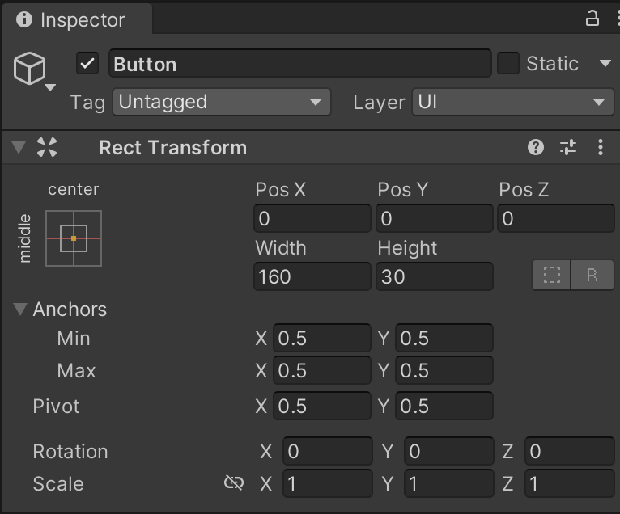
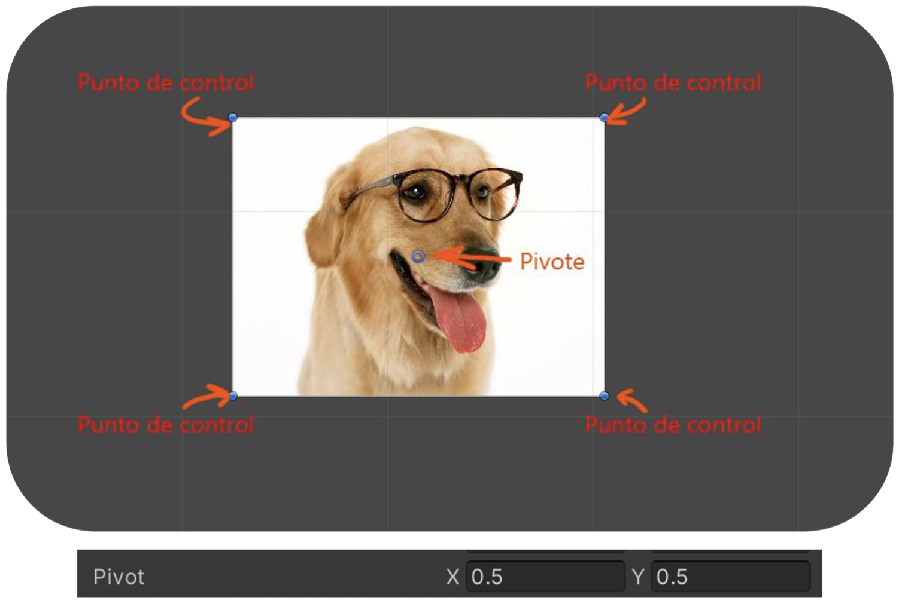
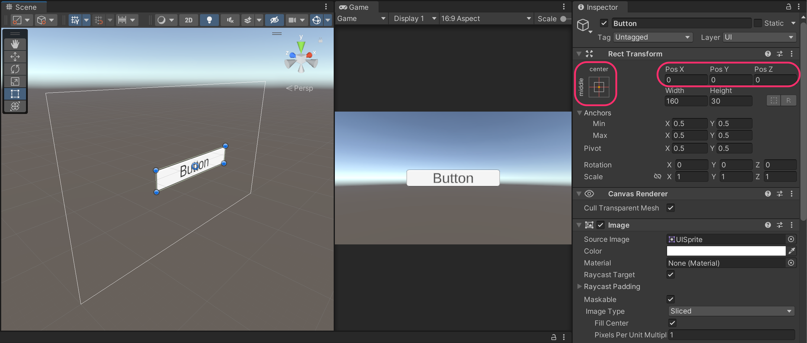
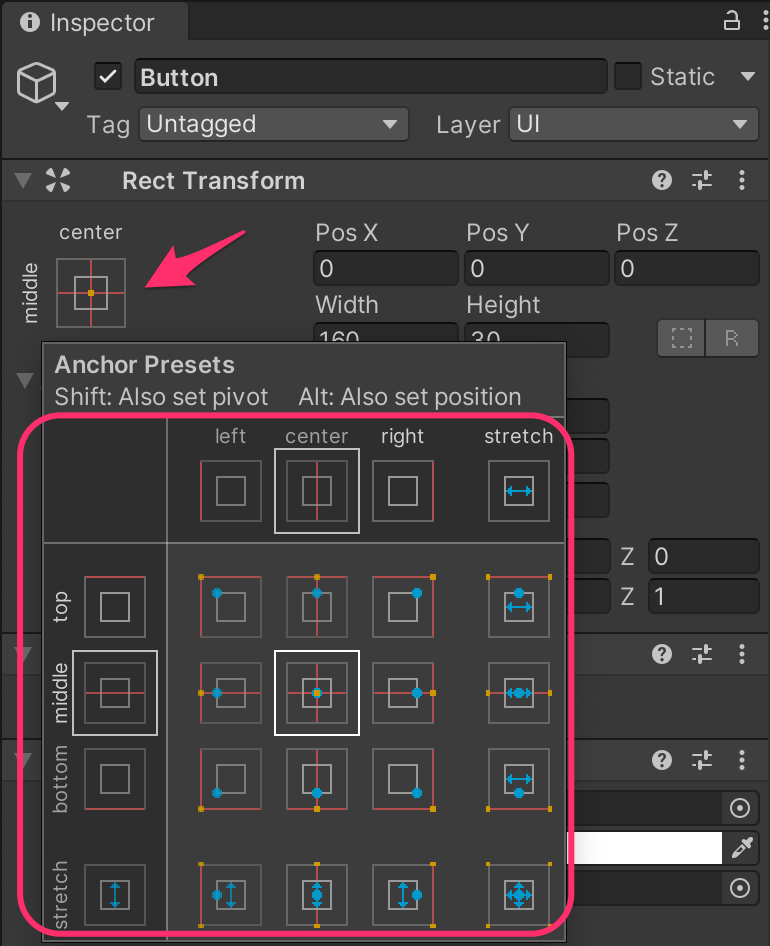
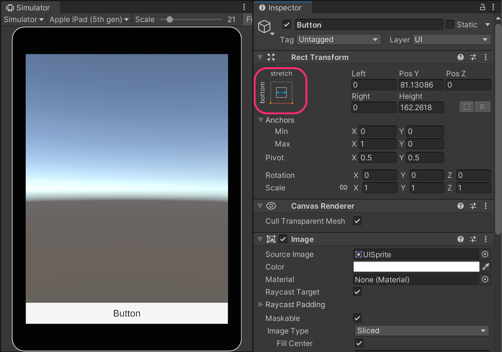
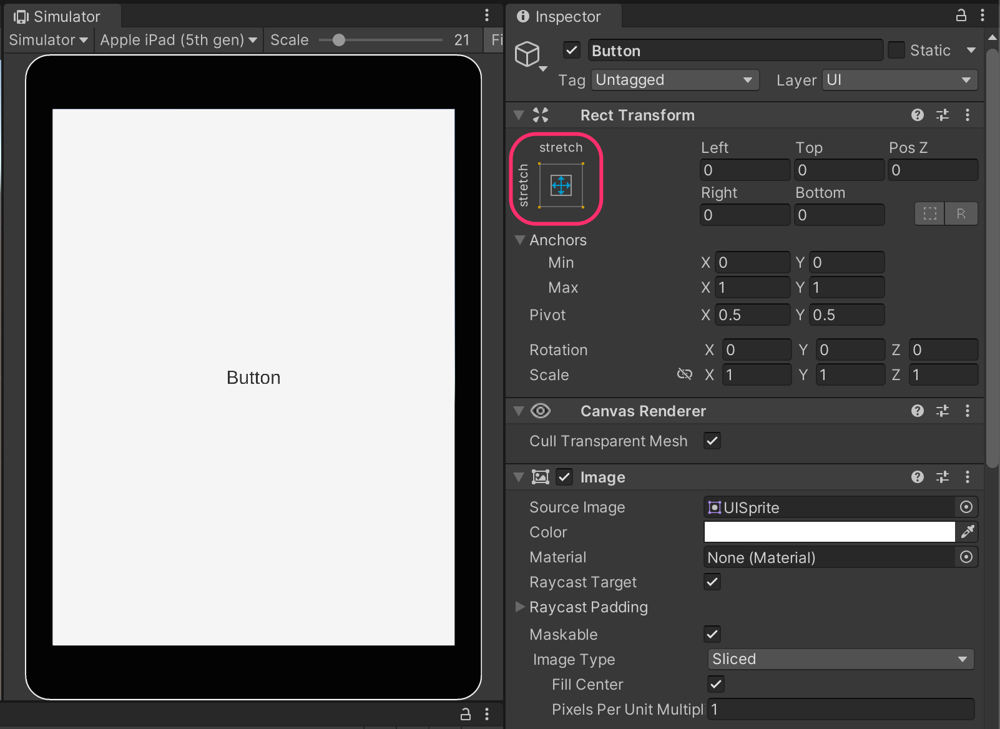
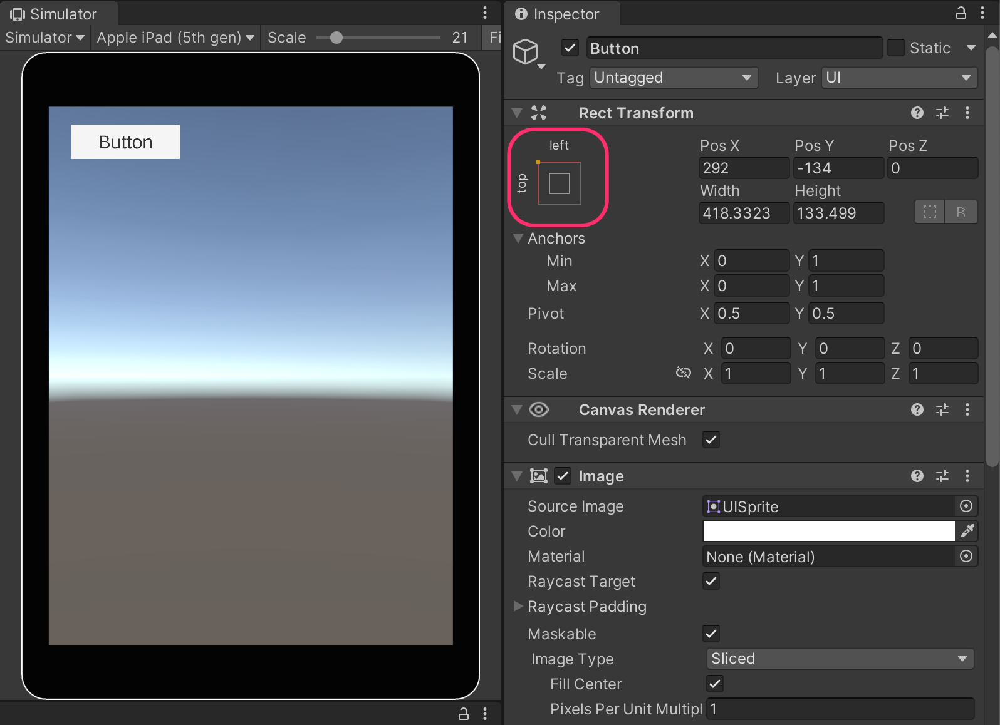

# RectTransform



This component is the **equivalent of a Transform** in the **3D world**, but it is specifically designed for positioning and arranging **UI elements** on the screen.

Every GUI element in Unity includes a **`RectTransform`** component.

***

#### RectTransform Attributes

The **RectTransform** defines several key properties of a UI element:

* **Position** of the element on the screen.
* **Width and height** (size of the element).
* **Rotation** of the element.
* **Pivot point** — the reference point for transformations (by default, the center of the element).
* **Anchors** — define how the element behaves relative to the screen or its parent container (for responsive layouts).

<figure><figcaption></figcaption></figure> <figure><figcaption></figcaption></figure>

***

#### Anchors

The **`RectTransform`** not only determines the position of a UI element but also **how it adapts** when the screen size or resolution changes.

Anchors make it possible to create **responsive interfaces**, maintaining consistent alignment and proportions across different devices.

There are two main types of anchors:

* <mark style="background-color:red;">**Red anchors**</mark>: define the **position** of the element.
* <mark style="background-color:blue;">**Blue anchors**</mark>: define the **size** or **stretch behavior** of the element.

<figure><figcaption></figcaption></figure> <figure><figcaption></figcaption></figure>

***

#### **Example 1**

Anchored to the **bottom of the screen**, spanning the entire available width:

<figure><figcaption></figcaption></figure>


Useful for elements like toolbars or status bars.


**Example 2**

Occupying the **entire screen space**, both in width and height:

<figure><figcaption></figcaption></figure>


Typically used for full-screen panels or background images.


**Example 3**

Anchored to the **top-left corner**, with a small margin, and **no stretch** applied.

<figure><figcaption></figcaption></figure>


Common for fixed-position elements like icons, labels, or buttons.

