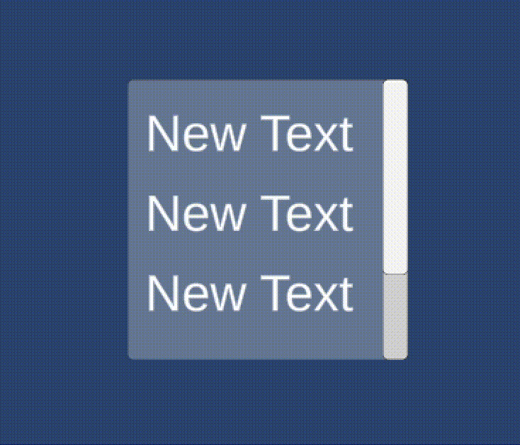

# ScrollView





This component enables users to **scroll through content** that does not fit entirely on the screen, providing an intuitive **drag or swipe gesture** to navigate vertically or horizontally.

Much like the **`Slider`**, the **Scroll View** is a **composite UI element** made up of several nested components, including:

* **Images**, which define the background and visual appearance of the scroll area.
* A **`ScrollRect`**, which manages the scrolling behavior and detects user gestures.
* One or more **`ScrollBars`**, used to indicate and control the current scroll position.
* The **Content** object, which holds the actual UI elements that move within the scrollable area.

This structure allows developers to present large or dynamic interfaces, such as lists, menus, or chat windows.

<figure><figcaption></figcaption></figure>


By adjusting the **Scroll Rect** properties, you can control scroll direction (vertical or horizontal), inertia, elasticity, and visibility of scroll bars for a polished and responsive user experience.

