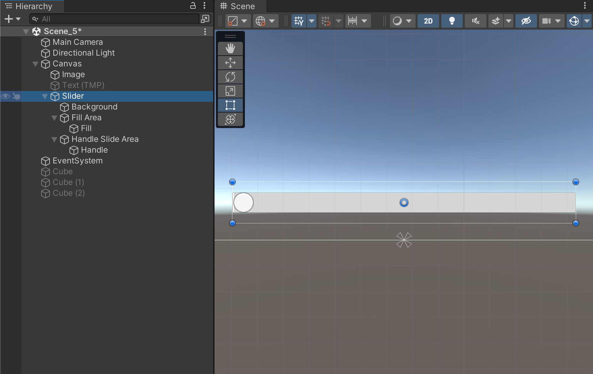
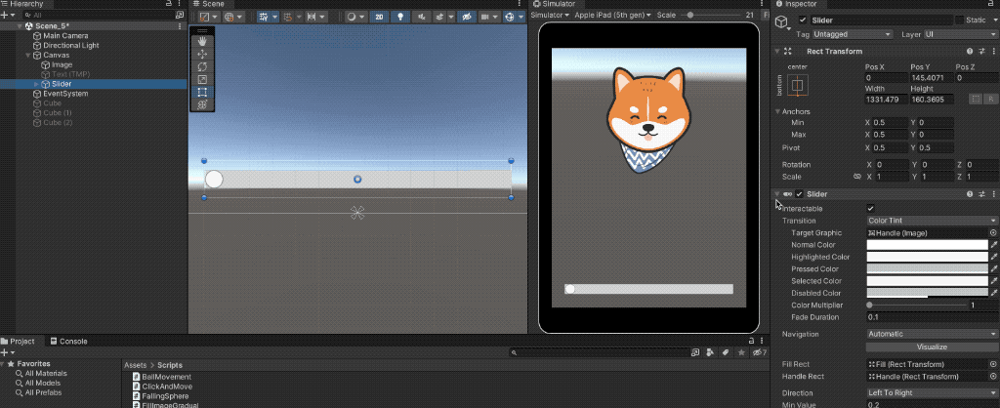
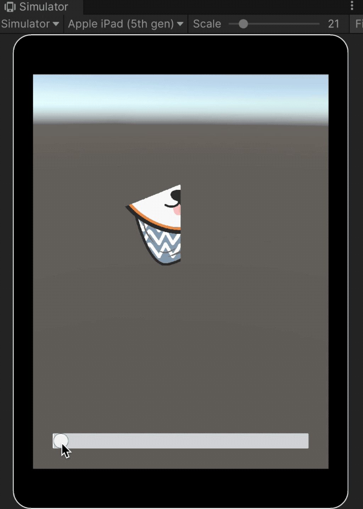

# Slider



The **`Slider`** is a composite UI component made up of a **hierarchy of objects**, typically several **Images** and the **`Slider`** component itself.

It allows the user to control a **numeric value** (either integer or decimal) through an interactive element, within a defined range **\[min\_value, max\_value]**.

This makes it ideal for interface controls such as:

* Volume or brightness settings.
* Progress bars.
* Sensitivity or speed adjustments.

<figure><figcaption></figcaption></figure>

***

### Controlling an Image’s Fill with a Slider

To visually link the slider’s value to an image (for example, to adjust its fill level):

* Add the following **custom component** to the image used in the previous example.

<pre class="language-csharp"><code class="lang-csharp">using UnityEngine;
using UnityEngine.UI;

public class SliderFillImage : MonoBehaviour
{
<strong>    private Image _img;
</strong>
    private void Awake()
    {
<strong>        _img = GetComponent&#x3C;Image>();
</strong>    }

<strong>    public void OnSliderChanged(float val)
</strong>    {
        _img.fillAmount = val;
    }
}
</code></pre>

* Connect the **`OnValueChanged()`** event of the **Slider** to the **`OnSliderChanged()`** method of the image’s **SliderFillImage** component.

<figure><figcaption></figcaption></figure>

* In this setup, the slider’s **minimum** is set to `0.2` and the **maximum** to `0.8`, defining the limits of the fill amount.

When configured, moving the slider will dynamically update the image’s **fill amount**, creating a smooth visual effect that responds to user input.

<figure><figcaption></figcaption></figure>
