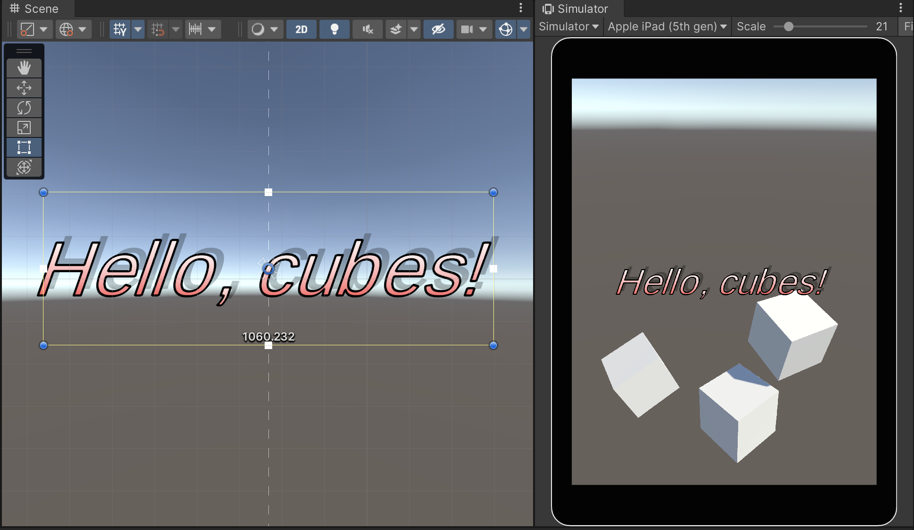
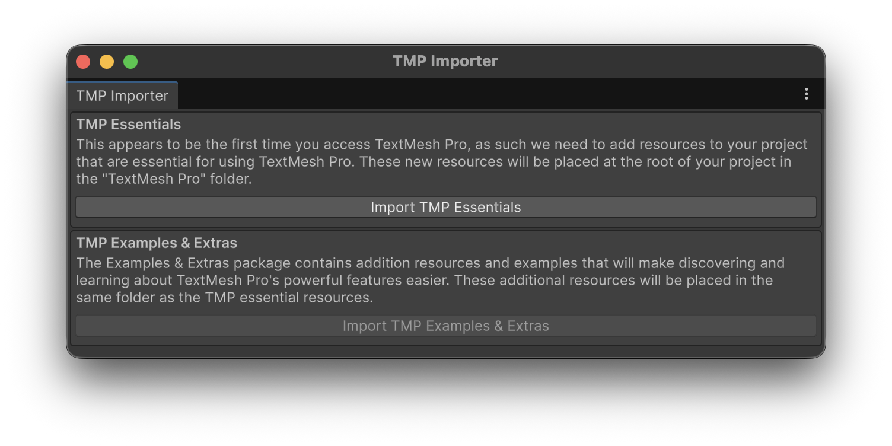

# Text



This component allows you to **render text** anywhere on the **Canvas** providing full control over its visual appearance and layout.

You can customize various properties, including:

* **Font**: choose the typeface used for rendering the text.
* **Size**: define the height of the characters.
* **Color**: set the color of the text.
* **Style**: apply bold, italic, or other formatting variations.
* **Content**: specify the text to display (can be updated dynamically from scripts).
* **Alignment**: control horizontal and vertical positioning within its RectTransform.
* **Outline and Borders**: add contours for better visibility.
* **Shadows**: create depth or contrast against different backgrounds.
* ...

<figure><figcaption></figcaption></figure>


You will have to import the _TMP Essentials_ the first time you add a text to a scene.


<figure><figcaption></figcaption></figure>
