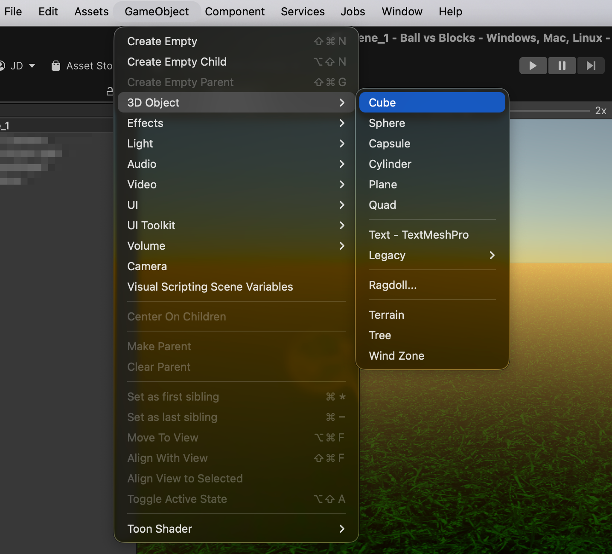
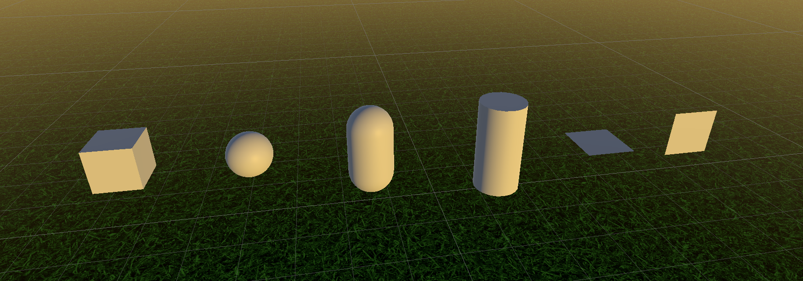

# Main components

As we’ve seen so far, the way we’ve been working follows this approach:

* **Creation of a scene or level** (a serializable asset).
* Inside the scene, there are several **GameObjects** that interact with each other.
* A **GameObject** is generic, it doesn’t have a specific purpose on its own; it’s the **components** we add to it that define what it does in the scene.

#### Examples of components

* A **Transform** defines its position.
* A **Renderer** allows it to be drawn on the screen.
* A **Camera** displays the scene to the user.
* A **Light** illuminates the environment.
* A custom **Script** (e.g., `BallMovement`) makes it move when certain keys are pressed.
* …

Each component has its own **attributes**, which we can modify to adjust its behavior:

* The **speed** in `BallMovement`.
* The **material** in a `Renderer`.
* The **position**, **rotation**, and **scale** in a `Transform`.
* …


One of the fundamental characteristics of **GameObjects** is their ability to be composed of different **components**.

This modular design allows us to add new **functionalities** or **behaviors** to them simply by attaching additional components.


<figure><figcaption></figcaption></figure>

***

### Primitives

Unity provides a set of **preconfigured GameObjects** (i.e., with certain specific components) that we can use directly in our scenes.

For example, creating a **Cube** generates a GameObject with:

* A **Transform**
* A **Mesh Renderer** and a **Mesh Filter**
* A **Box Collider**


We can also create our own templates using **Prefabs**, which allow us to save and reuse customized GameObject configurations.


<figure><figcaption></figcaption></figure>

<figure><figcaption></figcaption></figure>
