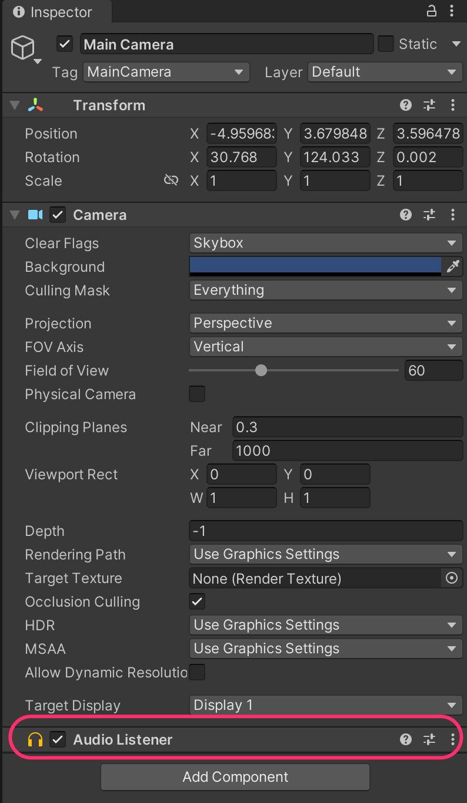

# Audio Source / Listener





The **`AudioListener`** component (usually attached to the **main camera**) allows Unity to “hear” sounds within a scene.

<figure><figcaption></figcaption></figure>

If a sound is played in **3D**, the **distance** between the sound source and the `AudioListener` affects its **volume** and **spatial perception**.

The **`AudioSource`** component enables any **GameObject** to **play sounds**.

#### Example setup

1. To test this, you can download a free sound asset from the Unity Asset Store:\
   [True 8-bit Sound Effect Collection - Lite version](https://assetstore.unity.com/packages/audio/sound-fx/true-8-bit-sound-effect-collection-lite-version-264063)
2. Add it to your project via the **Package Manager**.
3. Add an **`AudioSource`** component to all the spheres in your scene, and drag an **Audio Clip** from the imported assets (and deactivate the _Play On Awake_ property).
4. Finally, attach the following **script** to any element that will collide with other elements (such as de Player sphere).

<pre class="language-csharp"><code class="lang-csharp">using UnityEngine;

public class PlayingSoundOnCollision : MonoBehaviour
{
<strong>    private AudioSource _audioSource;
</strong>    private void Awake()
    {
<strong>        _audioSource = GetComponent&#x3C;AudioSource>();
</strong>    }

    private void OnCollisionEnter(Collision collision)
    {
<strong>        _audioSource.Play();
</strong>    }
}
</code></pre>
