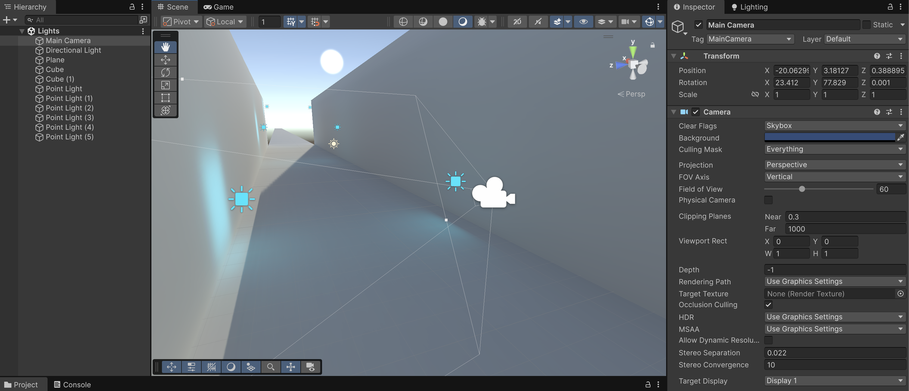
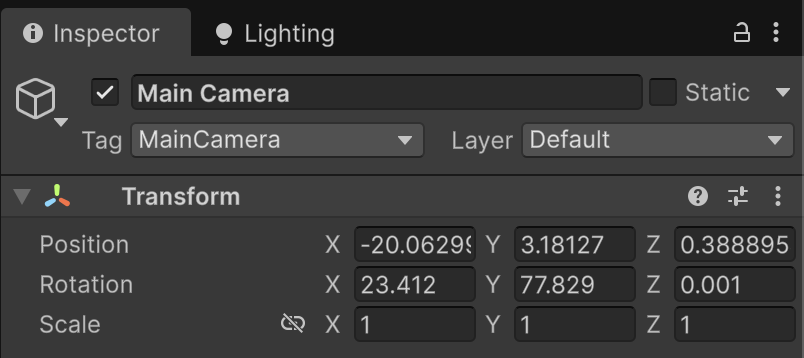
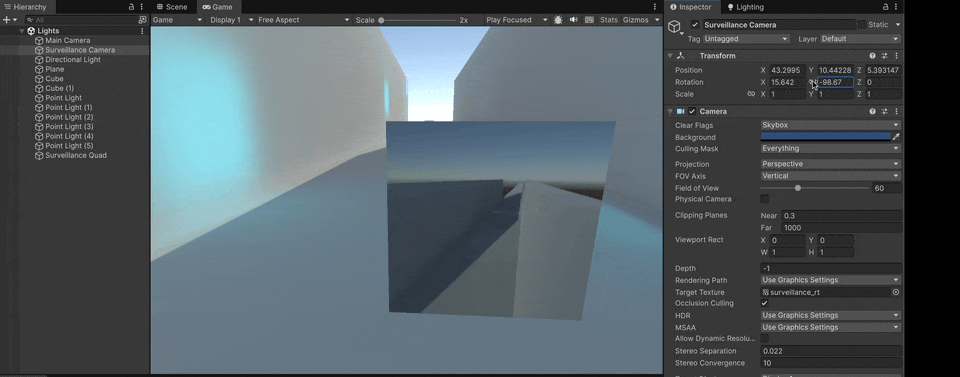

# Camera



The **`Camera`** component defines the **player’s view** of the scene.

It determines **what** is rendered and **how** it is displayed on the screen, functioning as the visual “eye” of the game.

<figure><figcaption></figcaption></figure>


Unity allows the use of multiple cameras, which can be combined to achieve effects such as **split-screen**, **mini-maps**, or **cinematic sequences**.


### Main Camera

By default, every new scene includes a **Main Camera**, which is automatically tagged as `"MainCamera"`.\
This is the camera that most scripts reference when accessing the player’s viewpoint.

<figure><figcaption></figcaption></figure>

#### Key Camera properties

* **Projection**: determines how 3D objects are projected onto the screen:
  * **Perspective** simulates depth (objects farther away appear smaller).
  * **Orthographic** keeps all objects the same size regardless of distance (useful for 2D or UI).
* **Field of View (FOV)**: defines how wide the camera’s viewing angle is.
* **Clipping Planes (Near/Far)**: specify the minimum and maximum rendering distances.
* **Clear Flags**: define what the camera clears before rendering (Skybox, Solid Color, Depth, or Nothing).
* **Depth**: controls the rendering order when multiple cameras are used.
* **Culling Mask**: lets you select which layers are visible to the camera.
* **Post-Processing Effects**: can enhance visuals with effects such as bloom, color grading, or depth of field.

### Example

To develop the following example, we'll need:

* **A new Camera** and position it on the surveillance position (rename it Surveillance Camera)
  * Set its _Depth_ to 0
* Specify the _Depth_ of the **Main Camera** to 1, so that is the one with more rendering priority
* Create a **Quad** and position it inside the frustrum of the Main Camera, create a **material** and drag it into the Quad, and create a [**Render Texture**](https://docs.unity3d.com/6000.2/Documentation/ScriptReference/RenderTexture.html) asset
* Drag the Render Texture asset into the **Albedo** property of the material
* To finish, **drag the Render Texture asset into the Target Texture field** of the Surveillance camera

<figure><figcaption></figcaption></figure>
