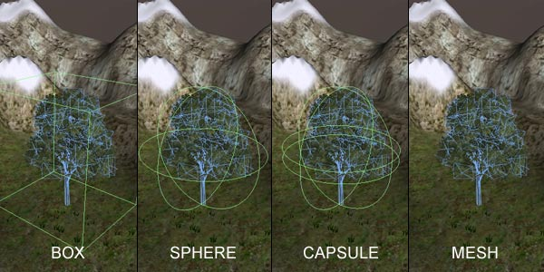
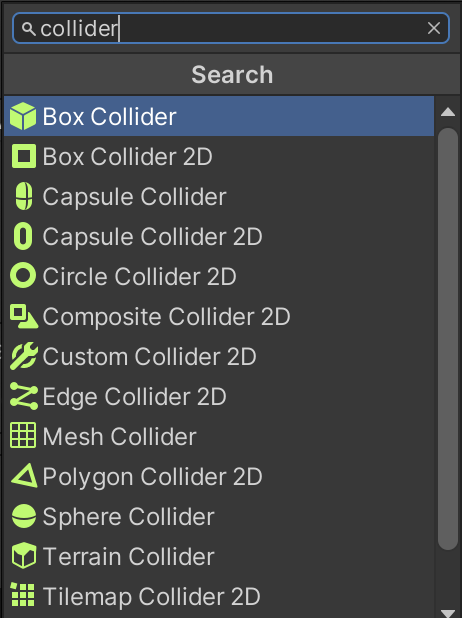
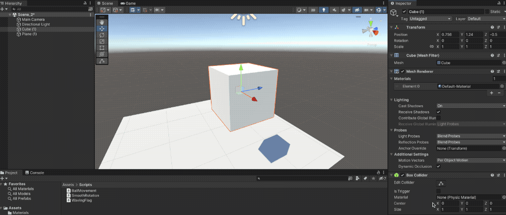
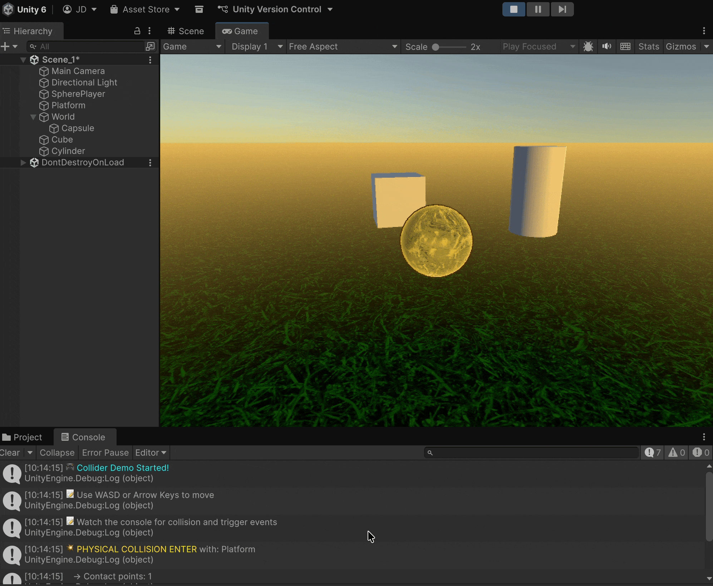

# Collider



A **`Collider`** is the geometry that a **GameObject** uses to detect **collisions** or **intersections** with other GameObjects.


For efficiency reasons, its mesh is usually **simpler** than the one defined in the **MeshFilter**.


<figure><figcaption><p>Collider meshes are usually simpler than renderer meshes</p></figcaption></figure>

<figure><figcaption><p>Different collider types</p></figcaption></figure>

Within this component, we can define several properties:

* The **physics material** (i.e., friction and bounciness).
* The **center** of the collision mesh.
* The **size** of the collision mesh.

<figure><figcaption></figcaption></figure>

Colliders can operate in **two different modes**, physical and trigger:

#### Physical Mode

In this mode, the **physics engine** is used to handle collisions and interactions realistically.

```csharp
void OnCollisionEnter(Collision other) { ... }
void OnCollisionExit(Collision other) { ... }
void OnCollisionStay(Collision other) { ... }
```

#### Trigger Mode

In this mode, the physics engine is **not used**; instead, Unity detects intersections based purely on **object positions**.

This is useful for detecting when objects enter, stay, or exit a region, without applying physical reactions.

```csharp
void OnTriggerEnter(Collider other) { ... }
void OnTriggerExit(Collider other) { ... }
void OnTriggerStay(Collider other) { ... }
```

### Example

<pre class="language-csharp"><code class="lang-csharp">using UnityEngine;

public class ColliderDemo : MonoBehaviour
{
    [Header("Movement Settings")]
    [Tooltip("Movement speed of the player")]
    public float moveSpeed = 250f;
    
    [Header("Status Indicators")]
    [Tooltip("Are we currently inside a trigger zone?")]
    public bool isInTriggerZone = false;
    
    [Tooltip("Are we currently touching a physical object?")]
    public bool isTouchingPhysicalObject = false;

    private Rigidbody _rb;
    private int _collisionCount = 0;

    private void Start()
    {
        _rb = GetComponent&#x3C;Rigidbody>();
        
        if (_rb == null)
        {
            Debug.LogError("⚠️ Rigidbody component is required for physics interactions!");
        }
        
        Debug.Log("🎮 &#x3C;color=cyan>Collider Demo Started!&#x3C;/color>");
        Debug.Log("📝 Use WASD or Arrow Keys to move");
        Debug.Log("📝 Watch the console for collision and trigger events");
    }

<strong>    private void FixedUpdate() // Physics engine update
</strong>    {
        // Simple movement controls
        float horizontal = Input.GetAxis("Horizontal");
        float vertical = Input.GetAxis("Vertical");
        
        Vector3 movement = new Vector3(horizontal, 0, vertical) * moveSpeed * Time.deltaTime;
        _rb.AddForce(movement);
    }

    // ============================================
    // PHYSICAL COLLISION EVENTS
    // These are called when colliding with objects that have colliders in physical mode
    // ============================================
<strong>    private void OnCollisionEnter(Collision collision)
</strong>    {
        ++_collisionCount;
        isTouchingPhysicalObject = true;
        
        Debug.Log($"💥 &#x3C;color=yellow>PHYSICAL COLLISION ENTER&#x3C;/color> with: {collision.gameObject.name}");
        Debug.Log($"   → Contact points: {collision.contactCount}");
        Debug.Log($"   → Relative velocity: {collision.relativeVelocity.magnitude:F2} m/s");
        
        // Example: Access the first contact point
        if (collision.contactCount > 0)
        {
            ContactPoint contact = collision.GetContact(0);
            Debug.Log($"   → Impact normal: {contact.normal}");
        }
    }

<strong>    private void OnCollisionExit(Collision collision)
</strong>    {
        isTouchingPhysicalObject = false;
        
        Debug.Log($"👋 &#x3C;color=orange>PHYSICAL COLLISION EXIT&#x3C;/color> from: {collision.gameObject.name}");
        Debug.Log($"   → Total collisions so far: {_collisionCount}");
    }

    // ============================================
    // TRIGGER EVENTS
    // These are called when entering/exiting colliders with "Is Trigger" checked
    // ============================================
<strong>    private void OnTriggerEnter(Collider other)
</strong>    {
        isInTriggerZone = true;
        
        Debug.Log($"🚪 &#x3C;color=green>TRIGGER ENTER&#x3C;/color> into: {other.gameObject.name}");
        Debug.Log($"   → Trigger bounds: {other.bounds.size}");
        Debug.Log($"   → This is NOT a physical collision - no forces applied!");
        
        // Example use case: Pickup item, open door, activate checkpoint
        /* if (other.CompareTag("Pickup"))
        {
            Debug.Log("   → 🎁 Item picked up!");
            // Destroy(other.gameObject); // Example: remove pickup
        }
        else if (other.CompareTag("Checkpoint"))
        {
            Debug.Log("   → 🏁 Checkpoint activated!");
        }*/ 
    }

<strong>    private void OnTriggerExit(Collider other)
</strong>    {
        isInTriggerZone = false;
        
        Debug.Log($"🚪 &#x3C;color=red>TRIGGER EXIT&#x3C;/color> from: {other.gameObject.name}");
        Debug.Log($"   → Player has left the trigger zone");
    }
}
</code></pre>

1. Attach this script to a sphere
2. Setup different primitives, with and without the _IsTrigger_ property activated on their individual colliders

<figure><figcaption></figcaption></figure>
