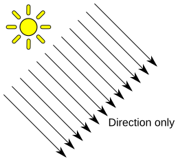
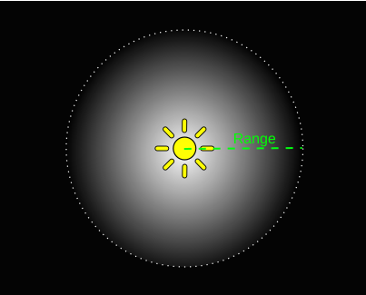
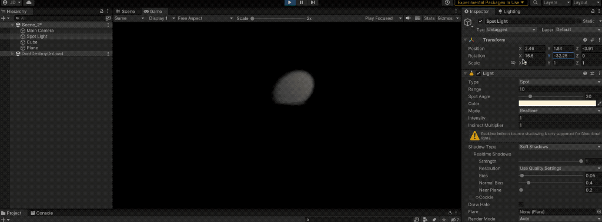
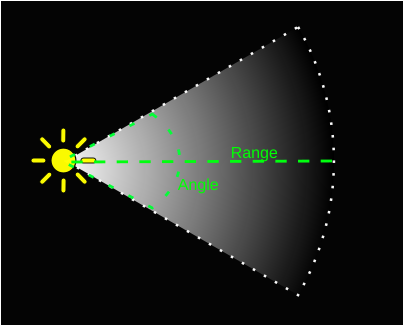
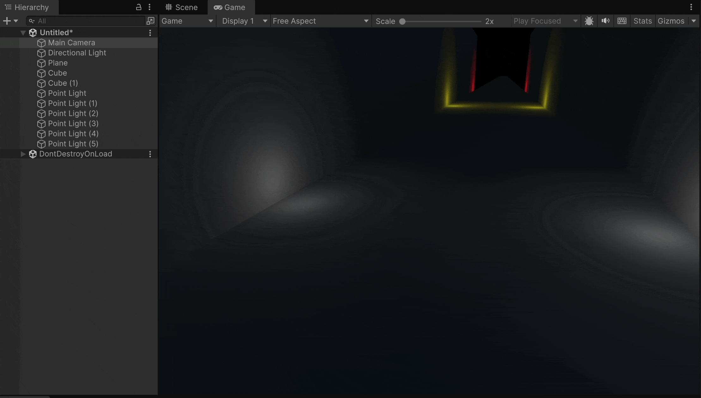

# Light



The **Light** component is responsible for **illuminating objects** within a Unity scene.

It defines how light interacts with materials, affecting the **appearance**, **shadows**, and **overall atmosphere** of the environment.

#### Key **Light properties**

* **Type**: defines the kind of light source.
* **Color** and **Intensity**: control the hue and brightness.
* **Range**: limits how far the light reaches (for Point and Spot lights).
* **Shadows**: determines whether the light casts shadows and their quality.

***

Unity provides several **types of lights**, each serving a different purpose:

* **Directional Light**: simulates sunlight; light rays are parallel and infinite in reach (the default one).

<figure><figcaption></figcaption></figure>

* **Point Light**: emits light in all directions from a single point, like a bulb.

<div><figure><figcaption></figcaption></figure> <figure><figcaption></figcaption></figure></div>

* **Spot Light**: projects light in a cone shape, useful for lamps or flashlights.

<figure><figcaption></figcaption></figure>

* **Area Light**: emits light from a rectangular surface (used mainly in baked lighting).

<figure><figcaption></figcaption></figure>

***

### Examples

#### With a Point Light

```csharp
using UnityEngine;

public class FlickeringLight : MonoBehaviour
{
    public AnimationCurve flickerCurve;
    public float speed = 1f;

    private float _startTime;
    private Light _light;

    private void Start()
    {
        _light = GetComponent<Light>();
        _startTime = Time.time;
    }

    private void Update()
    {
        float t = (Time.time - _startTime) * speed;

        // Evaluate light intensity from the curve
        _light.intensity = flickerCurve.Evaluate(t);

        // Loop the effect
        if (t > flickerCurve[flickerCurve.length - 1].time)
        {
            _startTime = Time.time;
        }
    }
}
```

<figure><figcaption></figcaption></figure>

#### Example with an Area Light (baked lights and static meshes)

<figure><figcaption></figcaption></figure>
