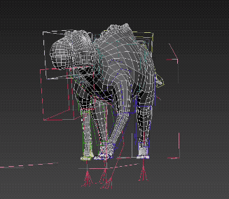
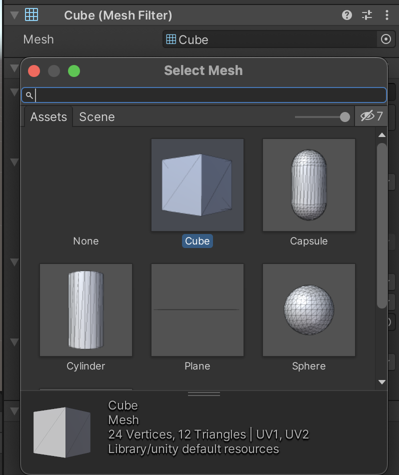
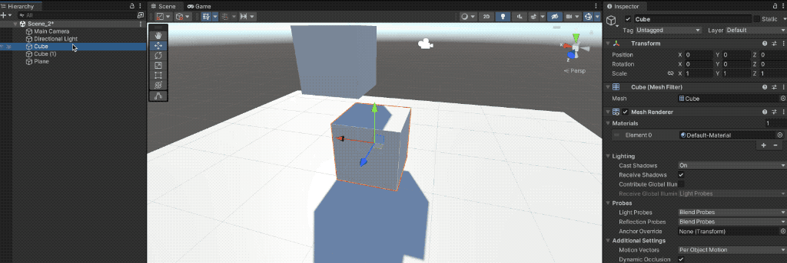
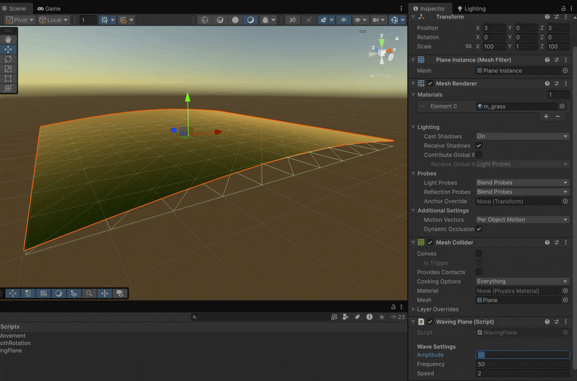

# Mesh Filter / Renderer





Both components usually work **hand in hand** to define the **geometry** and **visual appearance** of a 3D object.

* **`MeshFilter`** defines the **geometry,** that is, the shape of the 3D model.
*

    <div data-full-width="false"><figure><figcaption></figcaption></figure> <figure><figcaption></figcaption></figure></div>
* **`MeshRenderer`** renders that geometry, applying the corresponding **material**, **textures**, and **lighting effects** to display it on screen.

<figure><figcaption></figcaption></figure>

* Unlike when accessing the Transform component, if we want to access other components that are in the same GameObject, one approach is to use the [`GetComponent<T>()`](https://docs.unity3d.com/6000.2/Documentation/ScriptReference/GameObject.GetComponent.html) method:

```csharp
using UnityEngine;

public class WavingPlane : MonoBehaviour 
{
    [Header("Wave Settings")]
    [Tooltip("How high the waves go")]
    public float amplitude = 1f;
    
    [Tooltip("How many waves across the plane")]
    public float frequency = 1f;
    
    [Tooltip("How fast the waves move")]
    public float speed = 1f;
    
    private MeshFilter _meshFilter;
    private Mesh _mesh;
    private Vector3[] _originalVertices;

    private void Start() 
    {
        // Cache the mesh components
        _meshFilter = GetComponent<MeshFilter>();
        _mesh = _meshFilter.mesh;
        
        // Store the original flat plane positions
        _originalVertices = _mesh.vertices.Clone() as Vector3[];
    }

    private void Update() 
    {
        ApplyWaveEffect();
    }

    private void ApplyWaveEffect()
    {
        Vector3[] modifiedVertices = new Vector3[_originalVertices.Length];
        
        // Apply sine wave to each vertex
        for (int i = 0; i < modifiedVertices.Length; i++) 
        {
            Vector3 vertex = _originalVertices[i];
            
            // Calculate wave height based on time and position
            float waveHeight = amplitude * Mathf.Sin(Time.time * speed + vertex.x * frequency);
            vertex.y += waveHeight;
            
            modifiedVertices[i] = vertex;
        }
        
        // Apply the changes to the mesh
        _mesh.vertices = modifiedVertices;
        _mesh.RecalculateNormals(); // Update lighting
    }
}
```

<figure><figcaption></figcaption></figure>
