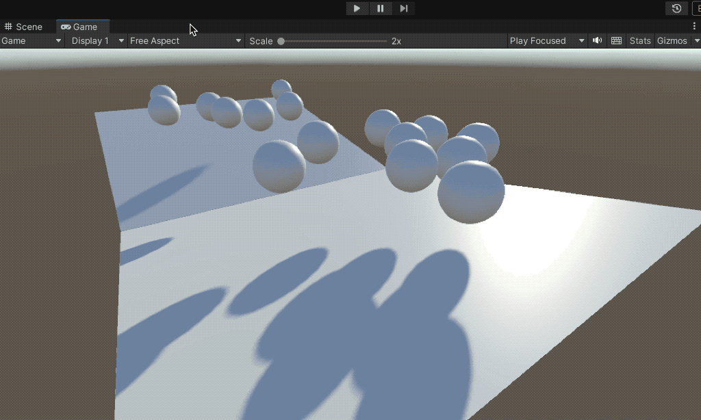
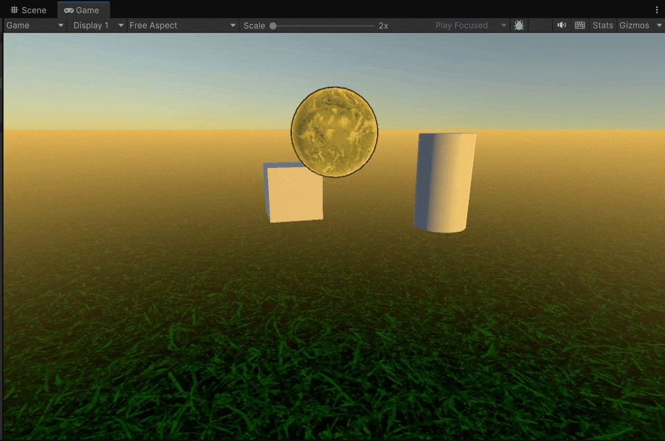

# RigidBody



Adding a **`Rigidbody`** component makes a **GameObject** interact with **Unity’s physics engine**, allowing it to behave according to physical laws such as:

* **Gravity**
* **Collisions**, **impacts**, and **bounces**
* **Attractive or repulsive forces**
* **Physics-based movement**

### Key **Rigidbody properties**

* **Mass**: determines how much force is needed to move the object.
* **Drag**: linear friction; slows down translation movement.
* **Angular Drag**: rotational friction; slows down spinning motion.
* **Use Gravity**: enables or disables the effect of gravity on the object.
* **Is Kinematic**: when enabled, the object is still managed by the physics engine but:
  * It **does not respond to gravity**.
  * It **is not affected by external forces**.

This setting is useful, for example:

* For **player-controlled characters** (via keyboard) that should detect collisions but not be fully governed by physics.
* For **moving platforms** or other animated elements that interact physically but follow scripted motion.

<figure><figcaption></figcaption></figure>

***

### Another example

<pre class="language-csharp"><code class="lang-csharp">using UnityEngine;

public class FallingSphere : MonoBehaviour
{
    [Range(1f,10f)]
    public float bounceForce = 5f;
    
    private Rigidbody _rb;
    private void Awake()
    {
        _rb = GetComponent&#x3C;Rigidbody>();
    }

<strong>    private void OnCollisionEnter(Collision collision)
</strong>    {
<strong>        if (collision.gameObject.CompareTag("Ground"))
</strong>        {
            _rb.AddForce(Vector3.up * bounceForce, ForceMode.Impulse);
        }
    }
}
</code></pre>

<figure><figcaption></figcaption></figure>
