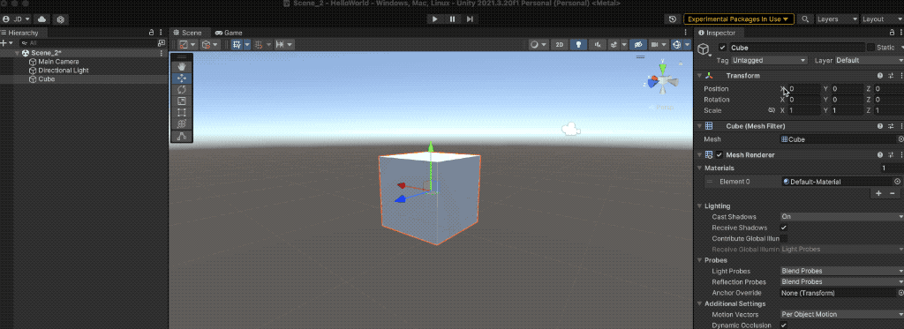
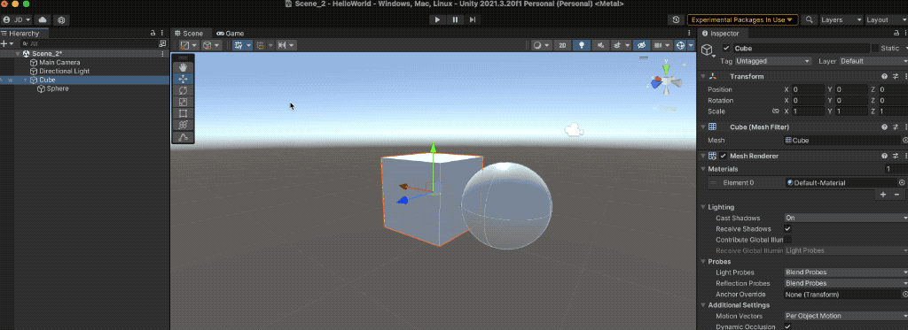
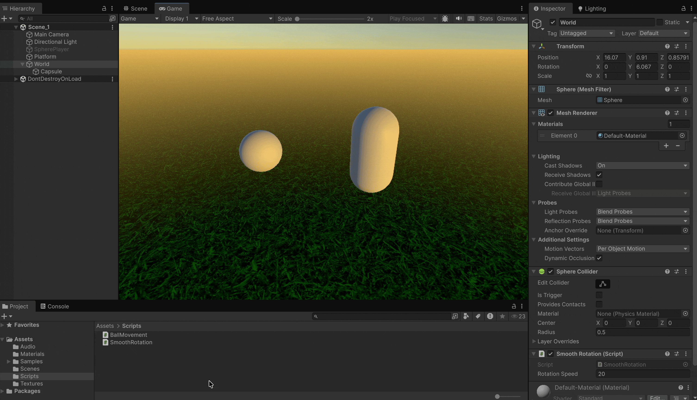

# Transform



The **`Transform`** component is present in all **GameObjects** and cannot be removed.

It defines the **local position**, **rotation**, and **scale** of the object, which are always relative to:

* The **world** (if the GameObject has no parent).
* A **parent GameObject** (if part of a hierarchy).

#### Examples

* Transformation relative to the world (no parent).

<figure><figcaption></figcaption></figure>

* Transformation within a **parent–child** relationship.

<figure><figcaption></figcaption></figure>

***

Since every GameObject includes a Transform, we can access it **directly from any script**:

```csharp
// Properties
transform.position = Vector3.back;
transform.localPosition = Vector3.forward;
transform.eulerAngles = new Vector3(1, 2, 3);
transform.localScale = Vector3.one * 3;
        
// Methods
transform.LookAt(Camera.main.transform.position);
transform.SetParent(null);
transform.Rotate(...);
```

```csharp
using UnityEngine;

public class SmoothRotation : MonoBehaviour
{
    public float rotationSpeed = 10f; // Rotation speed in degrees per second

    private void Update () {
        
        // Rotate around Y axis at a constant speed
        transform.Rotate(0f, rotationSpeed * Time.deltaTime, 0f);
    }
}
```

<figure><figcaption></figcaption></figure>
