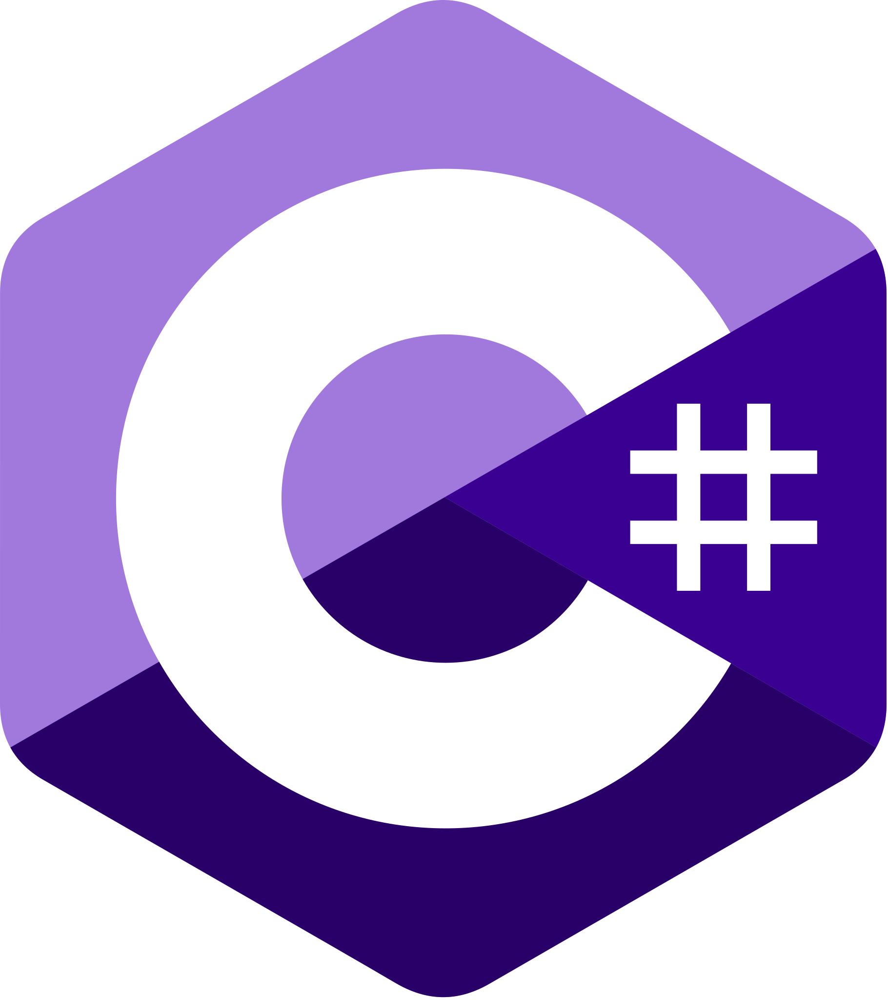

# The C# language

**C#** is an **object-oriented programming language** developed by Microsoft in 2000 as part of its .NET platform.

<figure><figcaption></figcaption></figure>

It is a **high-level language** designed to be efficient, secure, and easy to use, similar to languages such as _Java_, _C++_, and _Visual Basic_.

### Main Features

* **Object-oriented**: C# is an object-oriented language, which means that everything in C# is an object, even primitive types such as integers and characters.
* **Static typing**: C# is a statically typed language, which means that the type of a variable is determined at compile time and cannot change during program execution.
* **Garbage collection**: C# uses a garbage collection system to automatically manage memory, meaning programmers don’t need to worry about manually freeing memory.
* **Delegates and events**: C# supports delegates and events, which enable event-driven programming and greater modularity.
* **LINQ**: C# includes Language Integrated Query (LINQ), a technology that allows querying structured data such as collections, databases, and web services.

```csharp
var weaponItems = items.Where(x => x.ItemType.Equals("Weapon"));

// OR

var weaponItems = from item in items
                  where item.ItemType.Equals("Weapon")
                  select item;
```

* **Extension methods:** C# allows adding new methods to existing types without modifying the original source code, enabling the extension of functionality in existing libraries and classes.


Unity supports two backends for running C# code:

* **Mono**: A complete, open-source implementation of the .NET CLR. It uses JIT (Just-In-Time) compilation, converting IL bytecode to native code at runtime. Includes the full runtime and garbage collector.
* **IL2CPP**: Unity's proprietary technology that uses AOT (Ahead-of-Time) compilation. It converts IL bytecode to C++, which is then compiled to native code for the target platform before deployment.

We typically use IL2CPP because it offers better performance, smaller build sizes, broader platform support (especially mobile 64-bit requirements), and better security (no runtime compilation).


<figure><figcaption><p>For 64B architectures, we need to choose IL2CPP</p></figcaption></figure>
