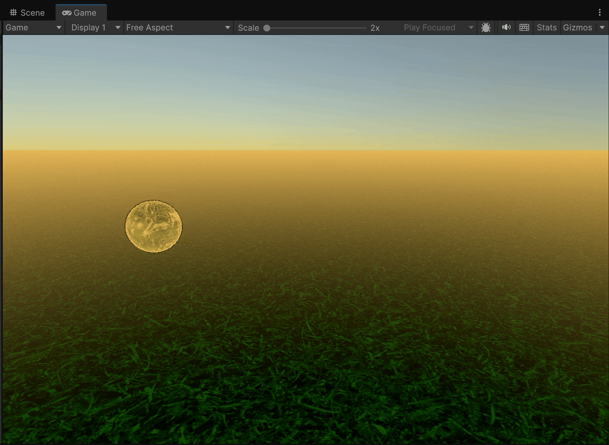

# Coroutines

In C#, a **coroutine** is a convenient way to **temporarily suspend the execution of a method** and **resume it later**, without manually tracking time inside the `Update` method.

Coroutines are a key feature in **Unity**, allowing developers to manage time-based behavior easily, such as waiting, sequencing animations, or handling asynchronous operations, **without blocking the main thread**.

<figure><figcaption></figcaption></figure>



### Key Characteristics

* **Controlled execution over time:** Coroutines are commonly used to execute code in **steps or intervals**, pausing between actions. This is especially useful for animations, timed events, or delayed actions.
* **Return type:** A coroutine is defined as a **method that returns an** `IEnumerator`.
* **Suspension with `yield`:** The `yield` **keyword** is used to **pause** the coroutine’s execution and **automatically resume it later**. The coroutine resumes right after the last `yield`, continuing until the next one or the end of the function.
* Coroutines are executed **alongside the main game loop**, but they **do not block** it.
* You can **stop** a coroutine at any time using `StopCoroutine()` or `StopAllCoroutines()`.
* Common yield instructions include:
  * `yield return null;` → Waits for the next frame.
  * `yield return new WaitForSeconds(t);` → Waits for _t_ seconds.
  * `yield return new WaitUntil(condition);` → Waits until a condition becomes true.
  * `yield return new WaitWhile(condition);` → Waits while a condition is true.

***

### Example

<figure><figcaption></figcaption></figure>

```csharp
using System.Collections;
using UnityEngine;

public class BallMovement : MonoBehaviour
{
    public Vector3 startPos = new (0, 1, 0);
    public Vector3 midPos = new (3, 3, 0);
    public Vector3 endPos = new (6, 1, 0);
    public float moveTime = 2f;
    public AudioSource bounceSound;

    private bool running = true; // To allow clean exit if needed

    private void Start()
    {
        transform.position = startPos;
        StartCoroutine(BallJourney());
    }
    // ... Here, the coroutines
}
```

<pre class="language-csharp"><code class="lang-csharp"><strong>    private IEnumerator BallJourney()
</strong>    {
        while (running)
        {
            // 1. Move up with easing
<strong>            yield return StartCoroutine(MoveObject(startPos, midPos, moveTime, easeOut: true));
</strong>            bounceSound?.Play();

            // 2. Pause briefly
<strong>            yield return new WaitForSeconds(0.4f);
</strong>
            // 3. Fall down with squash effect
<strong>            yield return StartCoroutine(MoveAndSquash(midPos, endPos, moveTime, easeIn: true));
</strong>            bounceSound?.Play();

            // 4, Wait before looping again
<strong>            yield return new WaitForSeconds(1f);
</strong>        }
    }
</code></pre>

<pre class="language-csharp"><code class="lang-csharp"><strong>    private IEnumerator MoveObject(Vector3 from, Vector3 to, float duration, bool easeIn = false, bool easeOut = false)
</strong>    {
        float elapsed = 0f;
        while (elapsed &#x3C; duration)
        {
            float t = elapsed / duration;
            if (easeIn) t = t * t;                    // ease in
            if (easeOut) t = 1 - Mathf.Pow(1 - t, 2); // ease out

            transform.position = Vector3.Lerp(from, to, t);
            elapsed += Time.deltaTime;
<strong>            yield return null;
</strong>        }
        transform.position = to;
    }
</code></pre>

<pre class="language-csharp"><code class="lang-csharp"><strong>    private IEnumerator MoveAndSquash(Vector3 from, Vector3 to, float duration, bool easeIn = false)
</strong>    {
        float elapsed = 0f;
        Vector3 originalScale = transform.localScale;

        while (elapsed &#x3C; duration)
        {
            float t = elapsed / duration;
            if (easeIn) t = t * t;

            transform.position = Vector3.Lerp(from, to, t);

            // Apply squash and stretch effect
            float squash = Mathf.Sin(t * Mathf.PI);
            transform.localScale = new Vector3(
                originalScale.x + squash * 0.2f,
                originalScale.y - squash * 0.2f,
                originalScale.z
            );

            elapsed += Time.deltaTime;
<strong>            yield return null;
</strong>        }

        // Reset to original state
        transform.position = to;
        transform.localScale = originalScale;
    }
</code></pre>

```csharp
    // Optional: stop the loop externally
    public void StopMovement()
    {
        running = false;
    }
```
