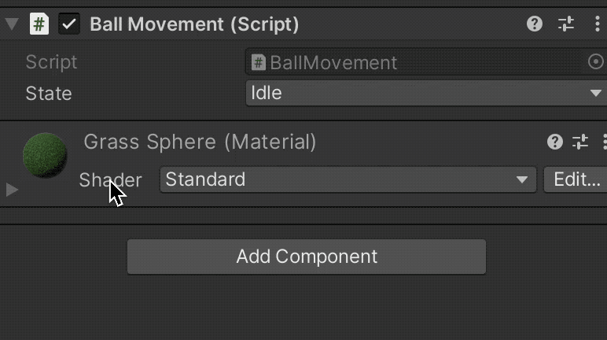

# Enums

Unity allows defining **enums** to create a new type whose value can only be one of those defined in a list.

* We use the `enum` keyword
* Internally, they are serialized as integers, so they are automatically serialized

```csharp
// Definition
public enum PlayerState {Idle, Running, Jumping, Dead}
```

```csharp
// Usage
public PlayerState state = PlayerState.Idle;
```

<figure><figcaption></figcaption></figure>
