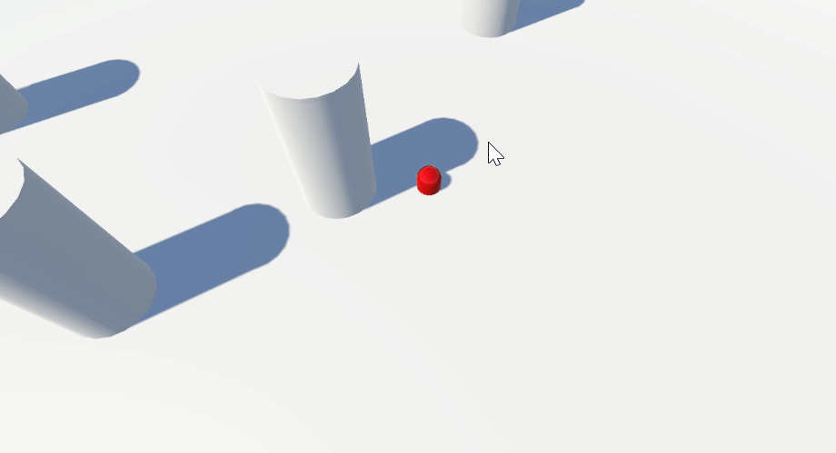

# The physics engine

Unity’s **physics engine** allows developers to **simulate real-world physical laws** within a virtual environment.

This enables dynamic and realistic interactions between objects in the scene.

For example, the physics engine supports:

* **Collision detection**: automatically determines when and how objects come into contact.
* **Simulation of forces and physical movements**: useful for vehicles, balls, characters, and any dynamic objects.
* **Physical properties**: such as **gravity**, **friction**, and **inertia**, which influence how objects move and respond to their surroundings.
* A [**raycasting**](https://docs.unity3d.com/6000.2/Documentation/ScriptReference/Physics.Raycast.html) **system**: which allows developers to simulate collisions or detect objects along a path **without requiring a** `Rigidbody` component. This is particularly useful for mechanics like shooting, visibility checks, or proximity detection.

<figure><figcaption>
Using the raycasting system to move the player to the clicked position
</figcaption></figure>
