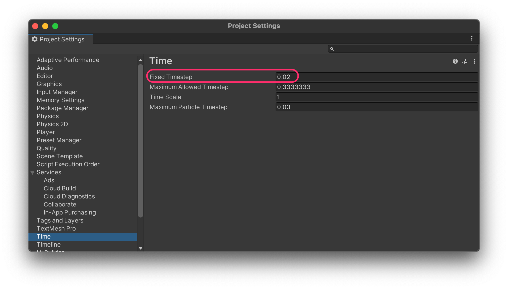
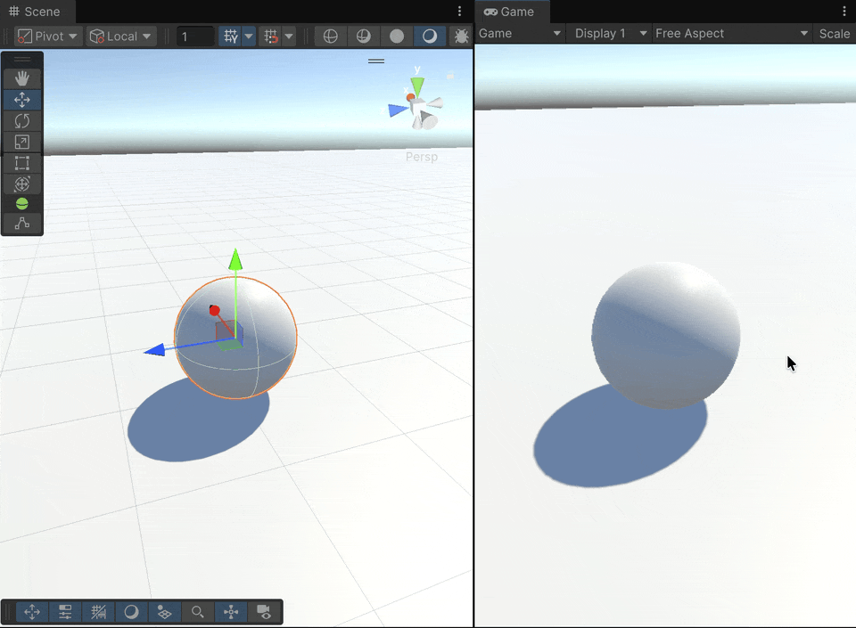

# Moving a sphere with forces

In this example, we’ll move the sphere from one of the previous exercises, but instead of updating the **`Transform`** directly, we’ll **apply a force** to make the movement more realistic.

1. **Create a new scene** and save it.
2. **Add a Plane** and a **Sphere** to the scene.
3. Add a **`Rigidbody`** component to the sphere.
4. Create a new script named **`SphereRealisticMovement`** and attach it to the sphere as a component.

```csharp
using UnityEngine;

public class SphereRealisticMovement : MonoBehaviour
{
    public float jumpForce = 5f;
    public float moveSpeed = 5f;

    private Rigidbody _rigidbody;

    private void Awake()
    {
        _rigidbody = GetComponent<Rigidbody>();
    }

    private void Update()
    {
        if (Input.GetKeyDown(KeyCode.Space))    // Better in Update
        {
            _rigidbody.AddForce(new Vector3(0f, jumpForce, 0f), ForceMode.Impulse);
        }
    }

    private void FixedUpdate()
    {
        float horizontalInput = Input.GetAxis("Horizontal");
        Vector3 movement = new Vector3(horizontalInput, 0f, 0f);
        _rigidbody.AddForce(movement * moveSpeed);
    }
}
```

<figure><figcaption></figcaption></figure>

***

#### FixedUpdate vs. Update

Unlike `Update()`, which runs once per frame (and thus varies depending on the frame rate), the `FixedUpdate()` method runs at a **fixed interval**, every **0.02 seconds** (i.e., 50 times per second).

Because it’s synchronized with the **physics engine**, `FixedUpdate()` is ideal for handling **forces**, **collisions**, and **physical simulations**.

<figure><figcaption></figcaption></figure>

<table data-header-hidden><thead><tr><th width="328.70703125"></th><th></th></tr></thead><tbody><tr><td><strong>Update</strong></td><td><strong>FixedUpdate</strong></td></tr><tr><td>Not tied to the physics engine</td><td>Tied to the physics engine</td></tr><tr><td>Used for user input detection</td><td>Used for collisions, forces, and motion</td></tr><tr><td>Often depends on <code>Time.deltaTime</code></td><td>Runs at a constant frequency</td></tr></tbody></table>

***

#### Creating a Physics Material

1. Create a new **Physics Material** asset in your project folder and name it **BouncyMat**.
2. Adjust its parameters and assign it to the **Sphere Collider** of the sphere.

**Physics Material parameters:**

* **Dynamic Friction:** The friction applied while the object is moving.
  * `0` behaves like ice, `1` gives maximum friction.
* **Static Friction:** The friction that affects the object when it starts to move.
* **Bounciness:** The amount of rebound after a collision.
  * `0` means no bounce.
  * `1` means a perfectly elastic bounce (no energy loss, assuming no other physical properties interfere).

<figure><figcaption></figcaption></figure>
