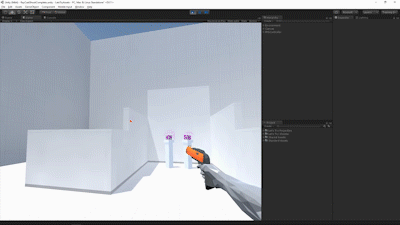
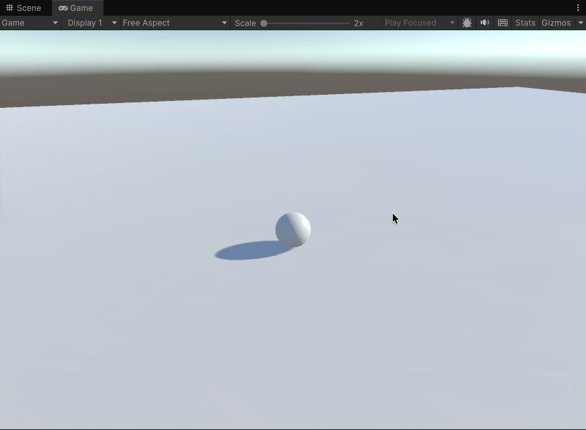

# Moving a sphere with raycasting

<figure><figcaption></figcaption></figure>

* Disable the **`SphereRealisticMovement`** script on the sphere.
* Create a new <mark style="background-color:$warning;">**Layer**</mark> (not a tag) named **“Ground”** and assign it to the plane (the floor).


**Layers** in Unity allow you to organize and separate **GameObjects** within a scene for various purposes, such as:

* **Filtering Raycasts**: determining which objects can be detected when casting rays.
* **Selective Rendering**: making specific cameras render only certain objects.
* **Collision Filtering**: defining which objects can or cannot collide with each other.

This system is essential for managing large or complex scenes, optimizing performance, and controlling interactions between different elements.


* Create a new script named **`ClickAndMove`** with the following code, and attach it to the sphere.

<pre class="language-csharp"><code class="lang-csharp">using UnityEngine;

public class ClickAndMove : MonoBehaviour
{
    [Range(1f, 10)]
    public float moveSpeed = 5f;
    
    [Range(0.1f, 2f)]
    public float stoppingDistance = 0.5f;

    private Rigidbody _rigidbody;
    private Camera _camera;
    private Vector3? _targetPosition;

    private void Awake()
    {
        _rigidbody = GetComponent&#x3C;Rigidbody>();
    }

    private void Start()
    {
        _camera = Camera.main;
    }

    private void Update()
    {
        if (!Input.GetMouseButtonDown(0)) return;
        
<strong>        Ray ray = _camera.ScreenPointToRay(Input.mousePosition);
</strong><strong>        LayerMask groundLayer = LayerMask.GetMask("Ground");
</strong>
<strong>        if (Physics.Raycast(ray, out var hit, Mathf.Infinity, groundLayer))
</strong>        {
            _targetPosition = hit.point;
        }
    }

    private void FixedUpdate()
    {
        if (_targetPosition == null) return;

        float distanceToTarget = Vector3.Distance(transform.position, _targetPosition.Value);
        
        if (distanceToTarget > stoppingDistance)
        {
            Vector3 direction = (_targetPosition.Value - transform.position).normalized;
            _rigidbody.MovePosition(transform.position + direction * (moveSpeed * Time.fixedDeltaTime));
        }
        else
        {
            _rigidbody.linearVelocity = Vector3.zero;
            _targetPosition = null;
        }
    }
}
</code></pre>

<figure><figcaption></figcaption></figure>
