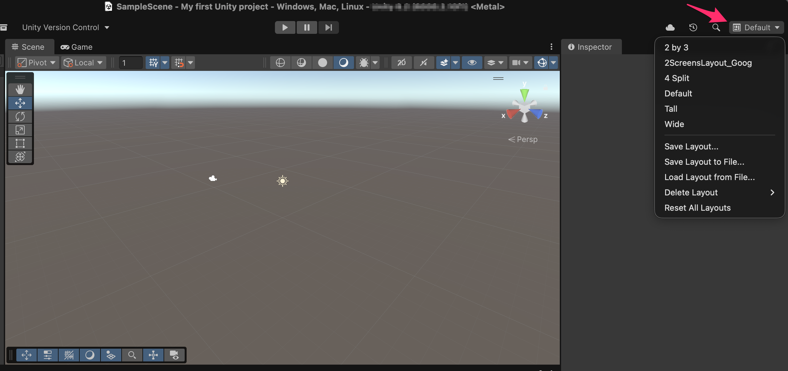

# Unity's interface

Unity, as such, offers a very powerful and flexible interface, so that the user can arrange the different windows for their convenience.

Unity offers a list of interface pre-configurations in the upper right corner of the editor:

<figure><figcaption>
Feel free to try other layouts and find the one suits your needs
</figcaption></figure>

Since we can place the windows wherever and however we like, the best thing is to "experiment" with the layouts, modifying them as we please (we can distribute the windows across multiple monitors) and save our own layout/distribution.
