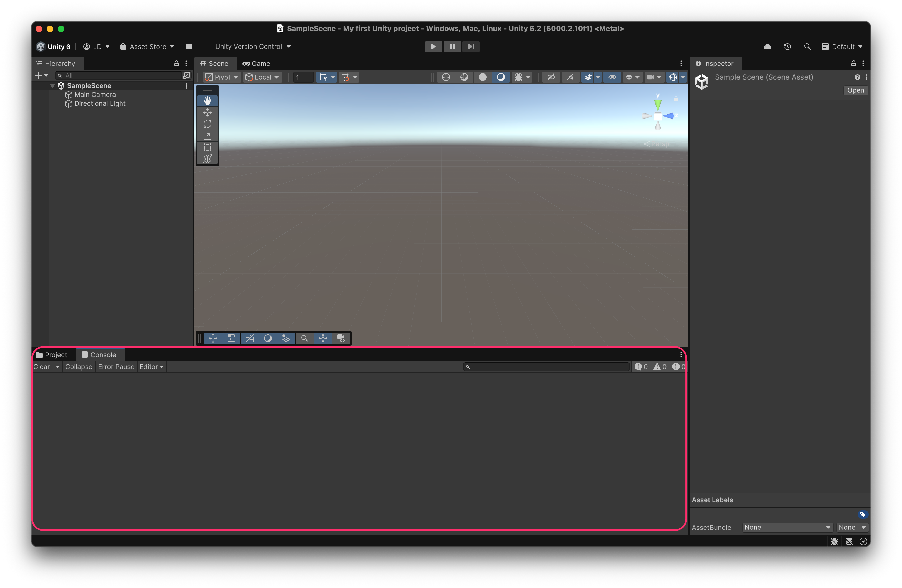

# Console view

The **Console view** displays **errors**, **warnings**, and **logs** that may occur during **resource import**, **program compilation**, or **runtime execution**.

It’s an essential tool for **debugging** and **monitoring the project’s behavior**, helping developers quickly identify and fix issues.

<figure><figcaption>
Empty for now, but an essential tool to understand how our game works and fixing errors
</figcaption></figure>
