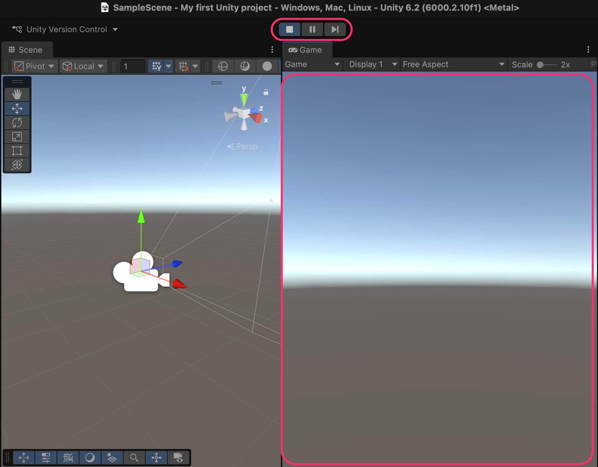
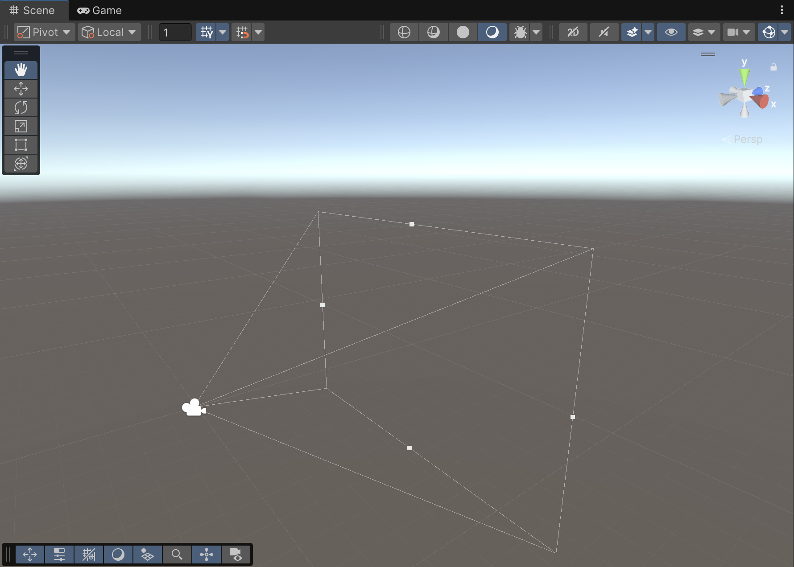
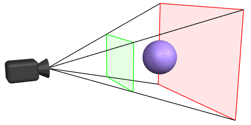

# Game view

The **Game view** allows us to **preview the game running** inside Unity.

To do this, we need to **run the game** by clicking the **Play** button on the **top toolbar**.

<figure><figcaption>
Play allows us to preview the game in the editor, while pause and step-by-step are used for game debugging
</figcaption></figure>


If we make **changes** to the game **while it’s running**, those changes will **not be persistent** — they will **disappear** once the game is stopped.


It’s important to distinguish that, at this point, there are two cameras: the **Game Camera** (selectable from the **Hierarchy view**) and the **Scene view camera**, which we use to edit the level.

When we **select the Game Camera**, we can see its **frustum**, that is, what it renders and, therefore, what the player will see. Elements outside the frustrum will not be rendered:

<figure><figcaption></figcaption></figure>

<figure><figcaption>
Elements too close, too far, or outside the boundaries of the frustrum, will not be rendered
</figcaption></figure>
