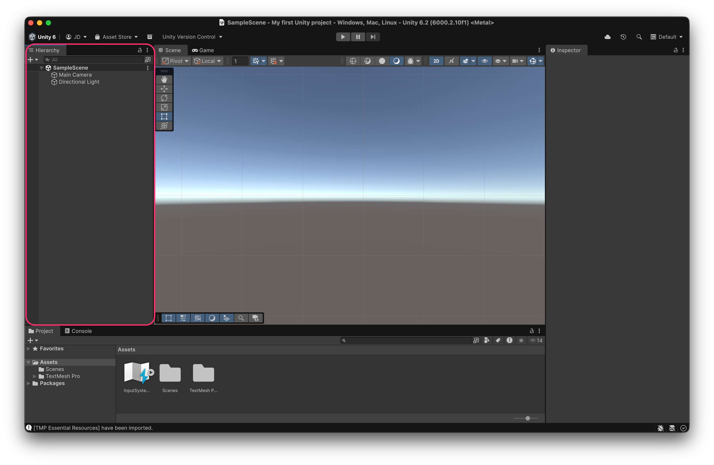
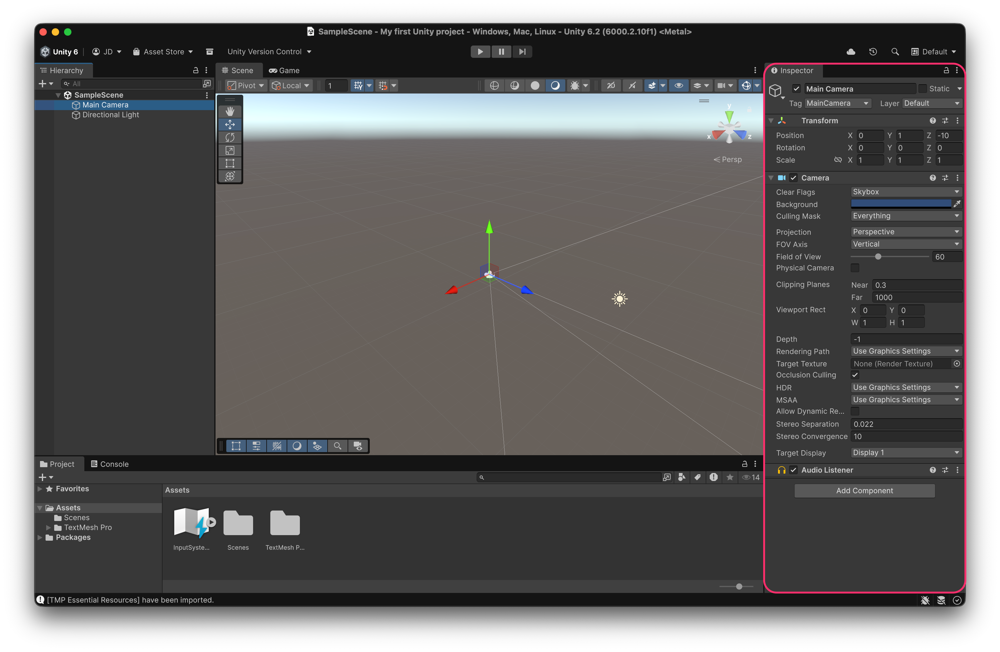
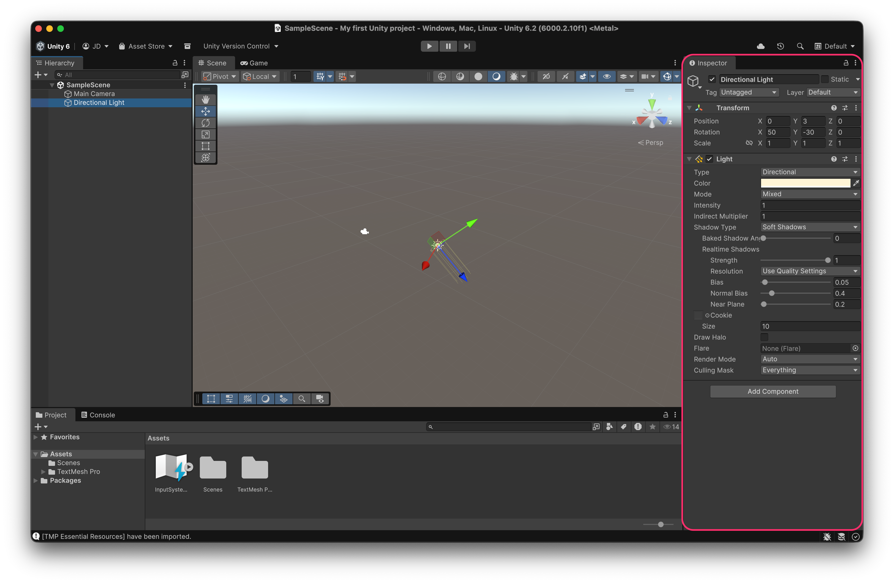
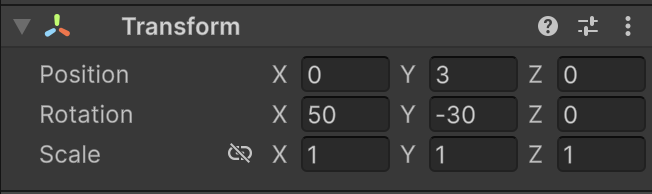
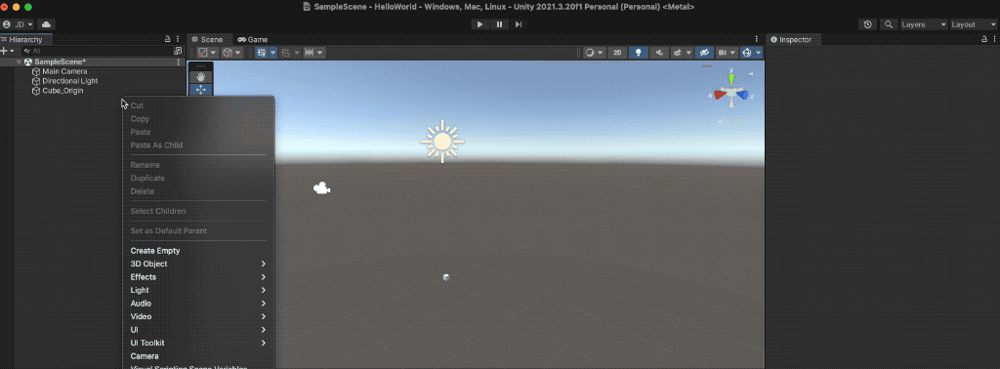

# Hierarchy view and Inspector

The **Hierarchy view** allows you to add and visualize the different **GameObjects** in the open scene. You can see that there is a **Main Camera** and a **Directional Light**, which are included by default when creating a new scene.

<figure><figcaption>
The <strong>Hierarchy view</strong> shows the hierarchy of <strong>GameObjects</strong> in a <strong>Scene</strong>
</figcaption></figure>

If we select a **GameObject**, in the **Inspector view** we can observe the **components** that make up that element:

<figure><figcaption>
Camera components in the <strong>Inspector view</strong>
</figcaption></figure> <figure><figcaption>
Light components in the <strong>Inspector view</strong>
</figcaption></figure>


Although we’ll see this in more detail later, we can notice that both **GameObjects** share a common component — the **Transform** component — which allows us to specify their **position**, **rotation**, and **scale**.



### **Hierarchical Relationship**

The different **GameObjects** within a scene form a _hierarchical tree_, meaning that a node/GameObject can have one parent GameObject and zero, one, or more child GameObjects.


The **parent-child relationship** is really important, since when a GameObject becomes a child of another, its **coordinate system changes** from global to local.


<figure><figcaption>
Cube at Global origin (0,0,0)
</figcaption></figure>

When we nest a GameObject inside another (by dragging it in the **Hierarchy view**), the child GameObject’s position **becomes** **local** **relative** to the **parent’s coordinate system**.

Any position, rotation, or scale **transformations** **applied to the parent** will affect the **child**.

<figure><figcaption>
<strong>Nesting</strong> a GameObject inside another makes the child's coordinate system <strong>relative</strong> to the parent
</figcaption></figure>
