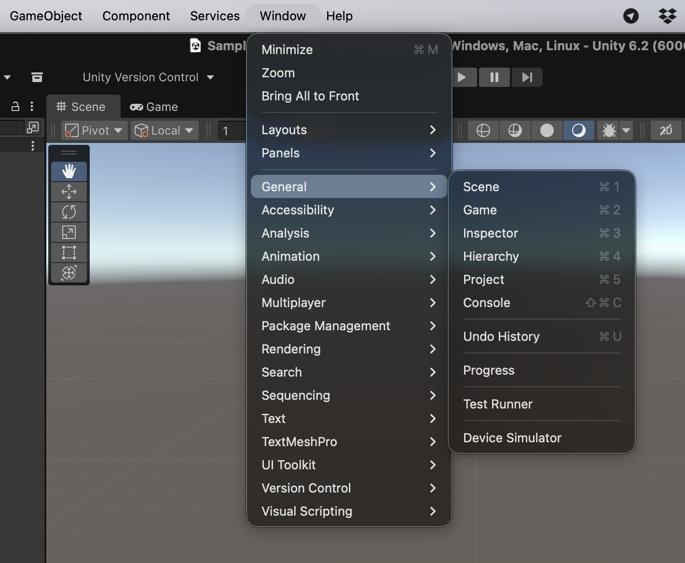

# Other views

Unity offers **many more windows**, each serving different purposes, such as:

* A\* Navigation
* Lighting
* Device Simulators
* Animations
* Analytics / Profiling
* Visual Scripting
* Version Control with PlasticSCM
* Package Management
* ...

Each of these tools provides **specialized functionality** that helps in tasks like **level design**, **performance optimization**, **testing**, and **project organization**.

<figure><figcaption>
The other views are accessible through the <strong>Window top menu</strong>
</figcaption></figure>
