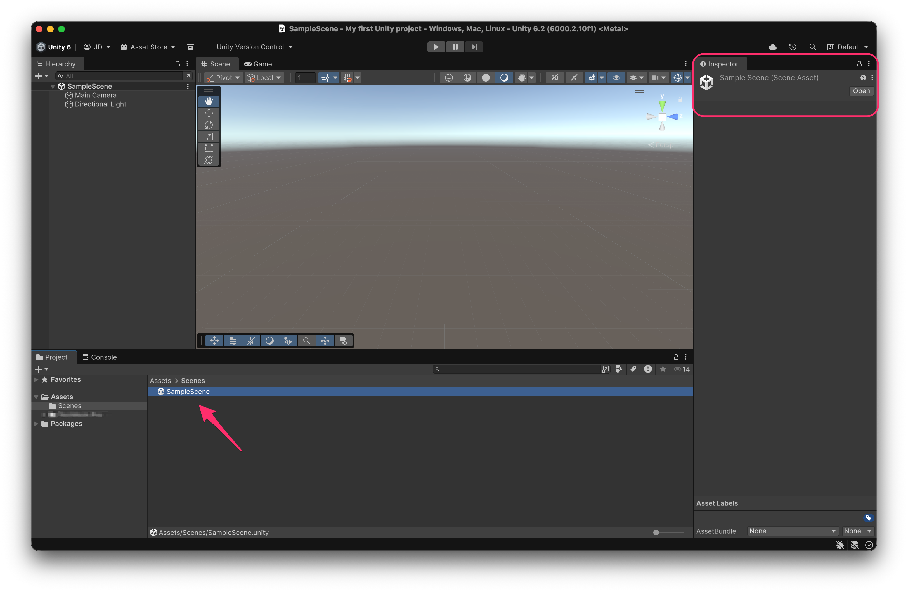
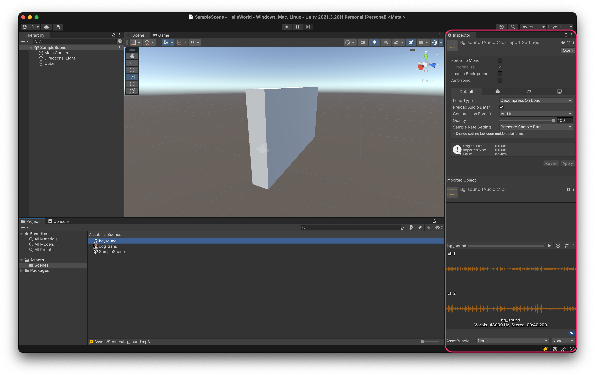
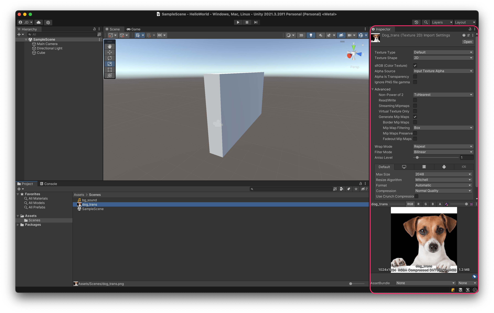

# Project view

The **Project view** allows us to **select and add assets** to the project. Among these, we can highlight:

* Folders and directory structure
* Scenes
* Prefabs
* Scripts
* Textures
* 3D Models
* Audio files
* Videos
* Configuration files
* etc.

Since we’ve just created the project, it currently contains only an **Assets** folder (the **root folder** for all project resources), a **Scenes** folder, and a resource named **SampleScene**, which is of type **Scene Asset** and contains the configuration of the current scene.

<figure><figcaption>
A Scene asset contains all the info about the GameObjects in a scene
</figcaption></figure>


Try **saving the scene** (Top menu: _File → Sav**e**_), then **create a new one** (**T**op menu: _File → New Scene_), and finally double-click on the **SampleScene** asset.

This action will **reopen** the previous scene, restoring it exactly as it was when you saved it.



The project folder structure is flexible — there are no strict “rules” — although it’s common to have folders named **“Scenes”**, **“Scripts”**, **“Textures”**, **“Audios”**, etc.

However, there are certain [**Special Folder Names**](https://docs.unity3d.com/Manual/SpecialFolders.html) that Unity recognizes and handles in a specific way:

* **📁 Resources** → Stores files that can be **loaded at runtime** using [`Resources.Load()`](https://docs.unity3d.com/ScriptReference/Resources.Load.html). This is useful for assets not directly referenced in scenes, or when we need to manually load/unload resources.
* **📁 Editor** → Contains **scripts that extend or modify the Unity Editor**’s functionality. These scripts are not included in the final build.
* **📁 StreamingAssets** → Used for **resources that should not be processed by Unity**, allowing direct access in their original format (e.g., videos, `.json` or `.yaml` files, SQLite databases, or modding support).
* **📁 Plugins** → Since Unity is **cross-platform**, this folder may contain **platform-specific subfolders** (like _Android_, _iOS_, etc.) with **native code** for each platform.
* **📁 Packages** → Located **outside** the **Assets** folder; this is where **packages installed via the** [**Package Manager**](scene-view.md) are stored.


### Adding an image and an audio assets to the project

First, download these assets:





If we drag files into the **Project view**, Unity will **import and process them automatically** according to their **file type**.

After the import, we can specify **how Unity should handle each file** — for example:

* Compression formats
* Use of alpha channels
* Generation of mipmaps
* And other platform-specific settings for the platforms we intend to export to.

This flexibility allows Unity to **optimize resources** for each target platform while maintaining **visual quality** and **performance efficiency**.

<figure><figcaption>
Settings for an <strong>Audio</strong> asset
</figcaption></figure>

<figure><figcaption>
Settings for a <strong>Texture</strong> asset
</figcaption></figure>
