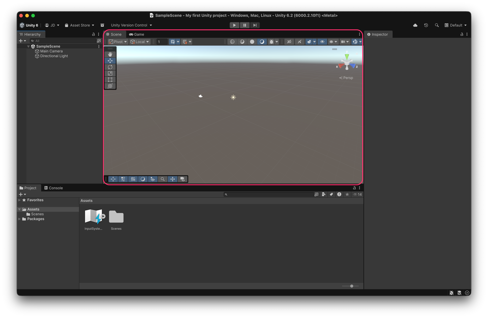
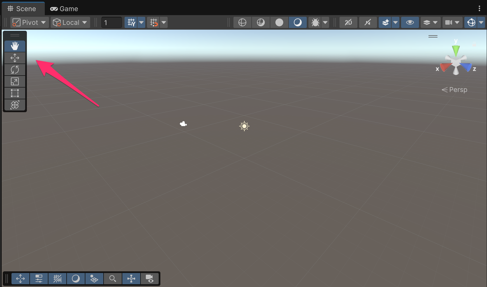
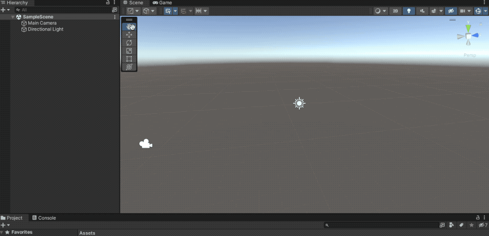
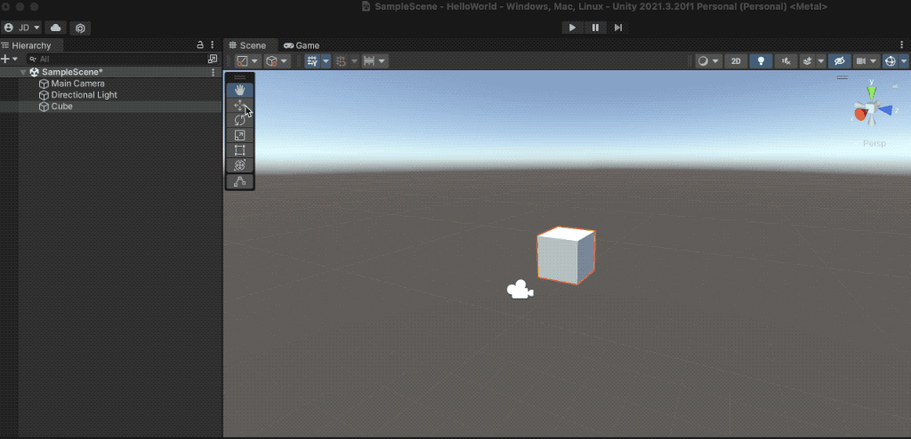
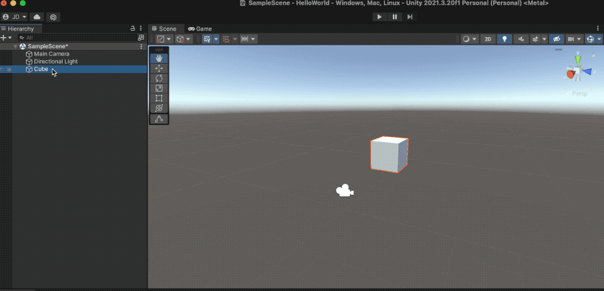
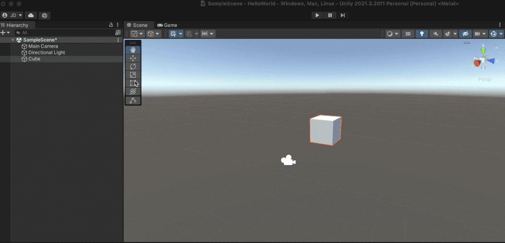
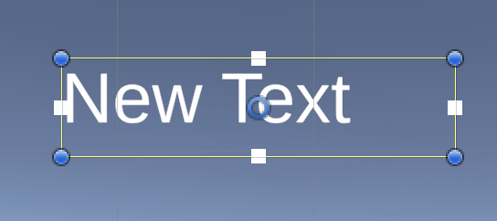
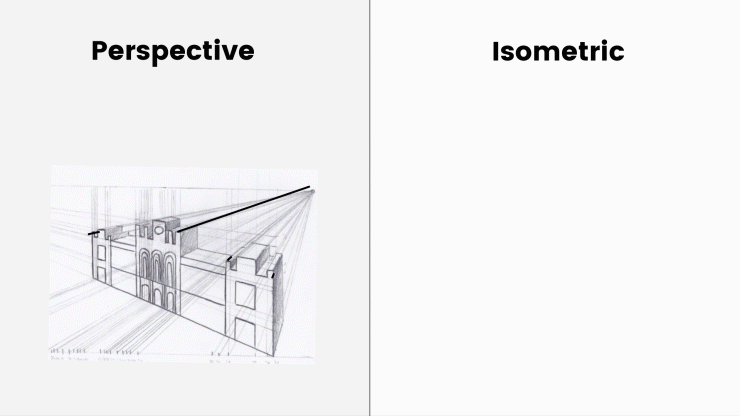
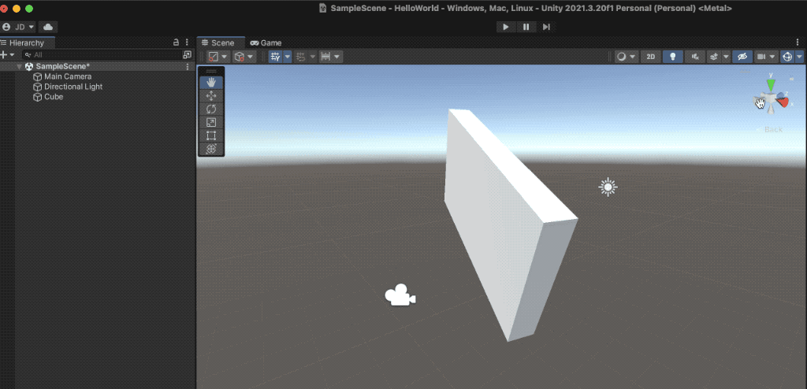

# Scene view

The **Scene view** is the main view in which we will edit "the world," the levels, the application screens...


A **Scene** will be composed of **GameObjects** with specific purposes (_cameras_, _lights_, _players_, _trees_, _buttons_, _texts_, _images_...). These **GameObjects** are generic (an element at a position, rotation, and scale in the world) and we will specialize them through **components**/scripts.

Additionally, a Scene in Unity is a serializable resource/asset (saved to disk) that we can use to store levels or screens of our game/application. This means that a 'Game' is made of different Scenes.


<figure><figcaption>
The 'default' scene has a directional light (i.e., sun) and a camera. We can see this through their gizmos/icons in the scene, and in the <strong>Hierarchy</strong> view
</figcaption></figure>

### Moving ourselves inside the Scene view

It is possible to move within the **Scene** view to edit the current scene/level/screen.

To select the action to perform, we have a toolbar within the **Scene** view itself:

<figure><figcaption>
Tools to move ourselves inside the <strong>Scene</strong> view, but also, the elements inside the scene
</figcaption></figure>



**Shortcut**: **Q** Key&#x20;

This tool allows us to navigate through the scene.

* With _Click & Drag_ in the scene, we will move along the X/Y plane according to the camera's orientation,
* _Ctrl + Click & Drag_ we will zoom (also with the mouse wheel or trackpad)
* _Alt/Option + Click & Drag_ we will orbit around the origin, or around a selected GameObject (Double-click)

<figure><figcaption></figcaption></figure>



**Shortcut**: **W** Key

After creating an object in the scene (Top Menu _GameObject_ → _3D Object_ → _Cube_),

Allows you to modify the object's position:

<figure><figcaption></figcaption></figure>



**Shortcut**: **E** Key

After creating an object in the scene (Top Menu _GameObject_ → _3D Object_ → _Cube_),

Allows you to modify the object's rotation:

<figure><figcaption></figcaption></figure>



**Shortcut**: **R** Key

After creating an object in the scene (Top Menu _GameObject_ → _3D Object_ → _Cube_),

Allows you to modify the object's scale:

<figure><figcaption></figcaption></figure>



**Shortcut**: **T** Key

This tool is specific for editing the GUI.

<figure><figcaption></figcaption></figure>



### Swapping between _Perspective_ and _Isometric_ views

<figure><figcaption></figcaption></figure>

In the **top-right corner** of the **Scene view**, there’s a **Gizmo** that we can use to:

* **Align the Scene camera** to a **specific axis**
* **Switch between** **Perspective** and **Isometric** view modes

This Gizmo is very useful for **navigating and orienting** yourself within the 3D scene, especially when working on **precise object placement** or **level design**.

<figure><figcaption>
The <strong>gizmo</strong> allows changing between a <strong>perspective</strong> and an <strong>orthographic</strong> view of the Scene view
</figcaption></figure>

<figure><figcaption></figcaption></figure>
